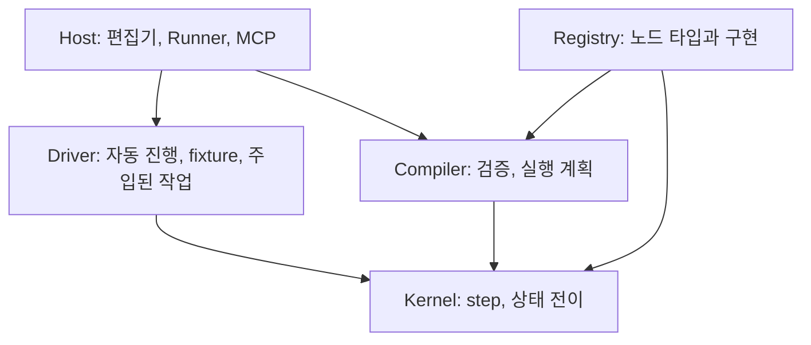

# Core가 하는 일

`@howling/core`는 플로 JSON과 입력을 받아 **실행 순서를 정하고, 노드를 평가하고, 외부 작업을 요청하고, 그 이유와 결과를 남기는** 라이브러리입니다.

Home Assistant가 없어도, 네트워크가 없어도 JSON 예제와 가짜 응답으로 전체를 검증할 수 있어야 합니다.

## 세 계층



- **Kernel**은 Promise를 상태에 넣지 않습니다. CPU 평가는 동기입니다.
- **Driver**는 같은 `step`과 `applyCommand`만 반복합니다. 별도 실행 엔진이 아닙니다.
- **Host**는 실제 I/O, 인증, 저장, 동시 실행 정책을 맡습니다.

## 공개 API

```ts
import {
  createEngine,
  createOfficialRegistry,
  createDryRunDriver,
  createLiveDriver,
  createRegistry,
  registerOfficialNodes,
} from "@howling/core";

const engine = createEngine({ registry: createOfficialRegistry() });

engine.compile(definition);
engine.startRun(plan, input, options);
engine.step(plan, state);
engine.applyCommand(plan, state, command);
engine.run(plan, state, driver);
engine.snapshot(state);
engine.restore(plan, snapshot);
```

| 메서드 | 하는 일 |
| --- | --- |
| `compile` | 정의를 검증하고 실행 계획을 만든다. 실패면 진단 목록. |
| `startRun` | 입력 복사, entry를 ready에 넣음, `run.started` |
| `step` | 준비된 노드 **하나**를 완료·실패·대기까지 |
| `applyCommand` | 외부 응답, 논리 시간, pause/resume/cancel |
| `run` | 준비 노드를 먼저 처리한 뒤 driver command를 반복 |
| `snapshot` / `restore` | JSON 상태 왕복. pending effect를 새로 발행하지 않음 |

`options`는 호출자가 넣습니다.

```ts
{
  runId: "run-1",
  mode: "dryRun", // 또는 "live". 중간에 바꾸지 않는다.
  logicalTime: 0, // epoch milliseconds. Core가 시계를 읽지 않는다.
  initialState: { mean: [800, 900] },
}
```

## 전이 결과

성공하면 새 상태를 돌려줍니다. 입력 상태는 바뀌지 않습니다.

```ts
type TransitionResult =
  | {
      ok: true;
      transition: {
        state: ExecutionState;
        events: ExecutionEvent[]; // 이번 전이에 생긴 것만
        effects: EffectRequest[]; // 이번 전이에 생긴 것만
      };
    }
  | {
      ok: false;
      state: ExecutionState; // 원래 상태
      diagnostics: Diagnostic[];
    };
```

잘못된 command는 새 작업을 시작하지 않습니다.

## 성공 기준 (v0.1)

다음을 HA 없이 재현하면 core의 첫 수직 기능이 됩니다.

1. 센서 이벤트를 run 입력으로 넣는다.
2. 이동 평균 노드가 상태를 사용한다.
3. 조건이 경로를 고른다.
4. 알림 노드가 effect intent를 만든다.
5. fixture 응답으로 진행한다.
6. 노드별 입력·출력·분기 이유·상태·예정 작업을 본다.
7. 같은 입력·상태·버전·응답 순서·시간이면 같은 결과가 나온다.

이 시나리오의 전체 스크립트는 [첫 플로](./03-first-flow.md)와 [Dry run](./09-dry-run.md)에 있습니다.

다음: [핵심 개념](./02-concepts.md)
