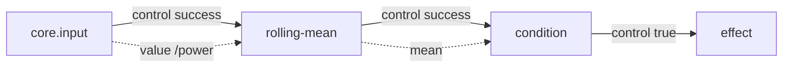

# 핵심 개념

Howling 플로는 n8n처럼 “이전 노드 출력이 다음으로 자동 흘러가는 파이프”가 아닙니다. **언제 실행될지**와 **어떤 값을 쓸지**를 따로 적습니다.

## 두 종류의 선

| 이름 | 역할 | 예 |
| --- | --- | --- |
| Control edge | 실행 순서 | `threshold.true` → `notify.in` |
| Output reference | 값의 출처 | `mean.mean`을 `threshold.left`에 연결 |

출력 참조는 대기를 만들지 않습니다. 값이 아직 없다면 compile이 거부하거나, `default`를 요구합니다.



실선은 제어, 점선은 값 참조입니다.

## WorkflowDefinition

저장·공유하는 JSON입니다. 캔버스 좌표는 넣지 않습니다.

```ts
{
  schemaVersion: 1,
  id: "power-alert",
  revision: "v1",
  entryNodeId: "input",
  nodes: [/* NodeInstance */],
  edges: [/* ControlEdge */],
}
```

노드 하나:

```ts
{
  id: "mean",
  type: "analysis.rolling-mean",
  version: 1,
  config: { windowSize: 5 },
  inputs: {
    value: {
      kind: "output",
      nodeId: "input",
      output: "value",
      path: "/power",
    },
  },
}
```

입력 바인딩 종류:

| kind | 의미 |
| --- | --- |
| `literal` | 고정 JSON 값 |
| `input` | 이번 run 입력. `path`는 JSON Pointer |
| `output` | 다른 노드가 **성공했을 때** 게시한 출력 |

`path`가 빈 문자열이면 전체 값입니다. `/power`는 필드, `/readings/0/value`는 배열 안입니다. `~1`은 `/`, `~0`은 `~`입니다.

`default`는 **경로가 없을 때만** 씁니다. 값이 `null`이어도 default를 적용하지 않습니다. `null`, `false`, `0`, `""`, `[]`, `{}`는 정상 값입니다.

숫자는 유한한 JSON 숫자만 됩니다. `NaN`, `Infinity`, `undefined`, 함수는 실행 데이터가 아닙니다.

## Run과 노드 실행

- **Run**: 외부 입력 한 번으로 시작한 플로 실행
- **Node execution**: 그 run 안에서 노드 하나가 시작해 끝날 때까지
- DAG 노드는 run당 최대 한 번 시작합니다
- Effect 응답으로 재개하는 것은 **같은** node execution입니다
- 반복·자동 재시도는 v0.1에 없습니다

## 엣지 상태

| 상태 | 의미 |
| --- | --- |
| `pending` | 아직 활성/종료가 확정되지 않음. fixture가 없으면 이렇게 남긴다 |
| `taken` | 이 길로 소비 노드를 진행할 수 있음 |
| `skipped` | 선택되지 않았거나 상위가 비활성 |
| `failed` | 처리되지 않은 상위 오류 |

pending을 skipped나 성공으로 바꾸지 않습니다.

## Effect와 상태의 세 종류

헷갈리기 쉬운 세 값을 구분합니다.

| 이름 | 예 | 수명 |
| --- | --- | --- |
| Continuation | MCP 응답을 기다리는 단계 번호 | 이 node execution이 끝날 때까지 |
| 실행 출력 | 이번 run의 `mean: 1080` | 이 run |
| 분석 상태 | 최근 센서 값 N개 | run 사이. Host가 저장 |

실패한 노드의 부분 상태 변경은 반영하지 않습니다. 먼저 성공한 노드의 제안 상태는 run이 실패해도 `proposedState`에 남습니다. 실제 영속화는 Host가 합니다.

## 결정성

같은 정의, fingerprint, 입력, 초기 상태, 노드 버전, 외부 응답 순서, 논리 시간이면 같은 최종 값·경로·effect intent가 나와야 합니다. Live에서 응답 순서가 바뀌면 ANY 승자도 바뀔 수 있으므로, 순서 자체는 재생 자료의 일부입니다.

다음: [첫 플로](./03-first-flow.md)
