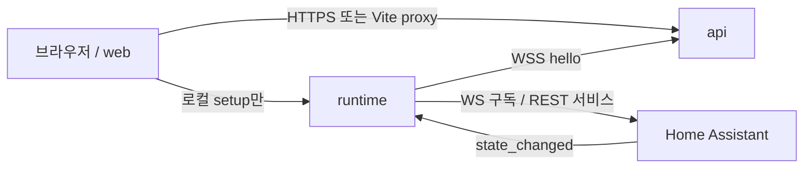

# 제품 개요

Howling의 제품 경로는 **브라우저에서 만든 플로가 로컬 Home Assistant를 바꾸고, 같은 run이 화면에 남는 것**입니다. 서버에 미리 넣어 둔 JSON만 실행되면 제품이 아닙니다.

실행 엔진은 [`@howling/core`](../core/01-overview.md)입니다. Core는 HA를 호출하지 않습니다. runtime이 `core.effect` intent를 받아 adapter를 호출합니다.

## 세 앱



| 앱 | 기본 주소 | 역할 |
| --- | --- | --- |
| web | `http://127.0.0.1:5173` | 상태, 연결, 편집기, 실행 상세 |
| api | `http://127.0.0.1:3000` | 세션, pairing, draft/revision/deployment, run 요약 |
| runtime | `http://127.0.0.1:4000` | SQLite 실행 루프, HA connector, 로컬 setup |

브라우저는 HA에 직접 가지 않습니다. HA URL과 long-lived token은 runtime 장비의 파일에만 있습니다.

## 한 번의 완결된 흐름

```text
로그인
→ runtime pairing
→ HA ready
→ 편집기에서 플로 작성
→ 저장 · 검증 · revision · 배포
→ active ACK
→ HA state_changed
→ run 종료
→ 실행 상세에서 같은 runId
```

배포 UI는 runtime이 `activation.result`로 `active`를 보내기 전에 완료로 표시하지 않습니다.

## 완료 시나리오

전력 평균 플로는 사용자가 캔버스에서 만듭니다.

```text
HA input_number.test_power state_changed
→ core.input { power }
→ analysis.rolling-mean window 5, path /power
→ core.condition gt 1000
→ core.effect homeassistant.call_service
   input_boolean.turn_on / input_boolean.test_alert
```

값 800, 900, 1100, 1200, 1400을 순서대로 넣으면 다섯 번째에서 평균 1080이 1000을 넘고 helper가 한 번 켜집니다.

## 화면

| 경로 | 하는 일 |
| --- | --- |
| `/` | API ready, runtime online, HA 상태 |
| `/connections` | pairing code 입력. secret 재조회 API 없음 |
| `/flows` | 초안·활성 revision·배포 상태, 최근 실행 |
| `/flows/:flowId` | 팔레트, React Flow, binding, 저장·검증·시험·배포 |
| `/runs/:runId` | revision, trigger, 노드/edge 이벤트. SSE, 실패 시 polling |

로컬 setup은 클라우드 편집기의 복제가 아닙니다. `http://127.0.0.1:4000/setup`에서 HA URL·토큰과 pairing만 다룹니다.

## 저장이 갈라지는 곳

| 위치 | 내용 |
| --- | --- |
| API PostgreSQL | site, 세션, pairing, draft, editor layout, revision, deployment, run 요약 |
| runtime SQLite | artifact, 활성 포인터, run, outbox, node 상태 |
| runtime 파일 `data/secrets/` | `ha-url`, `ha-token`, `runtime-token`. 권한 제한. DB에 넣지 않음 |

Editor 좌표만 바꾸면 revision digest가 바뀌지 않습니다. 늦은 이전 generation은 활성 포인터를 덮지 않습니다. 이미 수락한 run은 그 revision에 고정됩니다.

## 아직 없는 것

- MCP (외부 연결·플랫폼 `/mcp`)
- HA OS 앱, 관측 차트, 원본 전송 ON/보관 용량 UI
- 호스트 머신에 테스트 CA 설치

시험·SSE·rollback: [Dry-run과 운영 복구](./06-dry-run.md)

다음: [로컬 개발](./02-local-dev.md)
