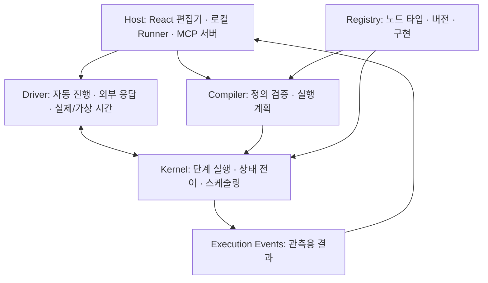
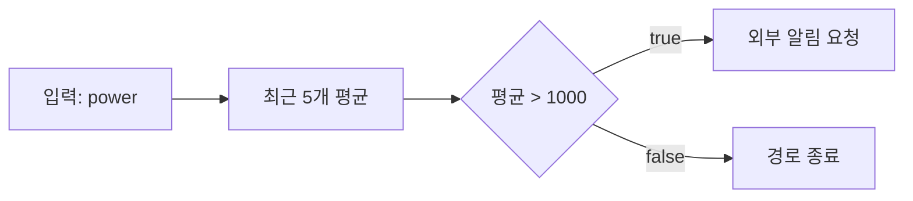
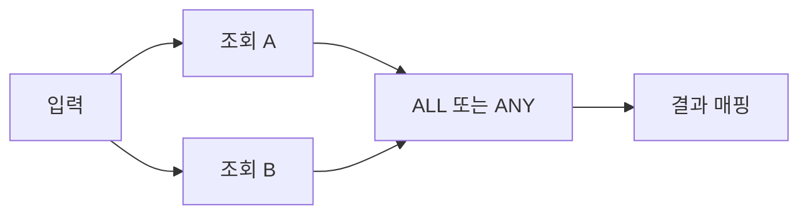

# Howling Core v0.1 상세 구현 계획

> 작성일: 2026-09-14
>
> 상태: 사용자와 확정한 방향을 상세화한 구현 계획
>
> 첫 산출물: `@howling/core` 독립 TypeScript 라이브러리
>
> 참고 대상: n8n, Dify 및 Dify의 독립 실행 엔진 Graphon

## 1. 목적과 확정된 방향

Howling은 Home Assistant를 이용한 시각적 자동화 플랫폼이다. React Flow 편집기, 로컬 실행, 클라우드 관리, MCP 양방향 연동, 데이터 분석 플러그인을 순차적으로 붙인다. 이번 작업은 이 기능들이 공통으로 사용할 실행 core에 집중한다.

Core의 목적은 **플로 정의와 입력을 받아 실행 순서를 결정하고, 노드를 평가하며, 외부 작업을 요청하고, 그 결과와 이유를 추적하는 것**이다. HA·MCP·React·데이터베이스가 없어도 JSON 예제와 가짜 응답으로 전체 동작을 검증할 수 있어야 한다.

### 1.1 사용자와 확정한 결정

| 항목 | 결정 |
| --- | --- |
| 첫 구현 단위 | 독립 실행 라이브러리 |
| 언어 | TypeScript |
| 실행 모델 | 실행 순서를 나타내는 연결선 + 이전 노드 출력의 명시적 참조 |
| 데이터 단위 | 이름 있는 JSON 출력. 배열도 하나의 값으로 취급 |
| 그래프 | DAG, 조건 분기, 여러 경로 실행, ALL·ANY 합류 |
| 실행 제어 | 같은 실행 세션의 단계 실행과 자동 실행 |
| Dry run | 가상 입력·상태와 기록·fixture 응답을 이용한 재생 |
| 확장 | 공식 노드와 분석 구현부터 제공. 타입·버전 기반 계약 준비 |
| 참조 제품 | n8n의 노드·데이터 시험 경험, Dify·Graphon의 그래프·변수·이벤트 구조 |

### 1.2 Core의 첫 성공 기준

다음 시나리오를 실제 HA나 MCP 없이 실행할 수 있으면 core의 첫 수직 기능이 완성된다.

1. 외부에서 전달한 센서 이벤트를 실행 입력으로 사용한다.
2. 상태를 사용하는 이동 평균 노드를 평가한다.
3. 조건을 판정하고 선택된 경로를 실행한다.
4. 외부 알림 작업의 intent를 생성한다.
5. fixture 응답으로 진행해 결과를 얻는다.
6. 노드별 입력·출력·분기 이유·상태 변경·예정 작업을 확인한다.
7. 같은 입력·초기 상태·버전·외부 응답 순서·시간 진행을 사용하면 같은 결과를 얻는다.

## 2. n8n·Dify에서 참고할 부분

아래의 제품 동작은 공식 문서와 소스에서 확인했다. Howling의 채택 방식은 자체 요구사항에 맞춘 설계 결정이다. `main`·`master` 소스는 바뀔 수 있으므로 구현 중 특정 내부 코드에 의존하게 되면 참고한 commit을 함께 기록한다.

| 참고 대상 | 확인한 사실 | Howling에 적용할 부분 |
| --- | --- | --- |
| n8n 데이터 구조 | 기본 전달 단위는 item 목록이며 일반적인 노드는 item별 작업을 수행한다 | 출력 참조와 데이터 출처 추적을 참고한다. 기본 단위는 명명된 JSON 출력으로 유지한다 |
| n8n 노드 인터페이스 | 노드 설명과 실행 함수를 구분하고 타입·버전으로 구현을 찾는다 | 선언적 `NodeSpec`과 실행 `NodeImplementation`, 명시적인 registry |
| n8n pin/mock | 저장한 노드 출력을 재사용해 시험할 수 있다 | 버전에 연결된 fixture와 실행 응답 재사용 |
| n8n Execute step | 선택 노드에 필요한 선행 노드까지 실행할 수 있는 부분 실행이다 | 개별 데이터 검사 경험을 참고한다. Core의 `step`은 같은 실행에서 노드 하나를 전진하는 기능으로 정의한다 |
| Dify·Graphon | 그래프, 실행별 변수, 스케줄링, 이벤트를 분리한다 | 실행 연결과 값 참조 분리, 실행별 출력 저장소, 준비 큐, 구조화된 이벤트 |
| Dify Variable Aggregator | 배타적 분기 중 실행된 경로의 값을 통일한다 | 합류의 실행 대기 규칙과 데이터 선택·병합을 별도 개념으로 유지한다 |

참고 자료:

- [n8n 데이터 구조](https://docs.n8n.io/build/work-with-data/understand-n8ns-data-structure)
- [n8n 노드 인터페이스](https://github.com/n8n-io/n8n/blob/master/packages/workflow/src/interfaces.ts)
- [n8n 노드 registry](https://github.com/n8n-io/n8n/blob/master/packages/cli/src/node-types.ts)
- [n8n pin/mock](https://docs.n8n.io/build/work-with-data/pin-and-mock-data)
- [n8n 실행 종류](https://docs.n8n.io/build/understand-workflows/understand-executions/types-of-executions)
- [Graphon 아키텍처](https://github.com/langgenius/graphon/blob/main/ARCHITECTURE.md)
- [Graphon VariablePool](https://github.com/langgenius/graphon/blob/main/src/graphon/runtime/variable_pool.py)
- [Dify Variable Aggregator](https://docs.dify.ai/en/cloud/use-dify/nodes/variable-aggregator)

다음 항목은 core v0.1에 가져오지 않는다.

- n8n의 item별 자동 처리·item lineage 계약 전체.
- 캔버스 좌표에 영향을 받는 실행 순서.
- n8n·Dify 플로 파일 형식의 호환 가져오기.
- Dify의 LLM·대화·RAG 전용 타입과 제품 기능.
- 분산 worker, 작업 큐 서버, 데이터베이스 연결, 플러그인 설치 시스템.

## 3. 책임 경계와 구조

### 3.1 세 계층



| 계층 | 책임 |
| --- | --- |
| Core kernel | 그래프 검증, 입력 해석, 노드 평가, 준비 큐, 합류, 실행 상태, effect intent, 이벤트 |
| Core driver | 같은 kernel API를 자동으로 반복하고 외부에서 주입한 응답·시간을 command로 반영 |
| Host | 트리거 수신, 실제 HA·MCP 통신, 인증정보, 저장, 프로세스 복구, 동시 실행 정책, UI·클라우드 |

Core 패키지에 자동 실행용 driver와 fixture용 driver를 제공하되 HA·MCP SDK, 파일·네트워크 클라이언트, 실제 타이머 구현은 포함하지 않는다. Live driver가 사용하는 실제 작업 함수와 대기 함수는 host가 주입한다.

### 3.2 핵심 구성 요소

| 구성 요소 | 입력 | 출력 |
| --- | --- | --- |
| Workflow compiler | 플로 정의, registry | 실행 계획 또는 진단 목록 |
| Value resolver | 입력 바인딩, 실행 입력, 노드 출력 | 해석된 입력 또는 진단 |
| Scheduler | edge 해소 상태, 노드 상태 | 준비된 노드 목록 |
| Node evaluator | 노드 구현, 해석된 입력, 상태, 논리 시간 | 완료·실패·외부 작업 대기 |
| Transition processor | 실행 상태, 명령 | 새 상태, 이벤트, 새 effect intent |
| Driver | 실행 계획, 상태, 실행 환경 | 반복 진행 및 최종/대기 결과 |

### 3.3 의존성 원칙

- Core는 React, React Flow, HA, MCP SDK, DB, HTTP 서버에 의존하지 않는다.
- 실행 정의에 좌표·색상·선택 상태·패널 상태를 넣지 않는다. 편집기가 별도로 보관한다.
- Core는 `Date.now()`, `Math.random()`, 네트워크, 파일, 환경변수로 실행 결과를 결정하지 않는다.
- 시간·식별자·외부 결과는 명시적으로 전달한다.
- Kernel은 JSON으로 직렬화할 수 있는 상태 전이를 수행한다. 실제 I/O를 기다리는 Promise를 상태에 넣지 않는다.
- 노드 구현은 신뢰된 코드다. Core 패키지 자체를 임의 JavaScript의 보안 sandbox로 취급하지 않는다.

## 4. 용어와 상태의 구분

| 용어 | 의미 |
| --- | --- |
| WorkflowDefinition | 사용자가 저장·공유하는 실행 그래프 정의 |
| CompiledWorkflow | 검증된 정의와 인접 목록·준비 조건·참조 정보 |
| NodeSpec | 노드 타입·버전·입출력·설정·상태·제어 포트의 선언 |
| NodeImplementation | 선언된 입력을 처리하는 신뢰된 실행 코드 |
| Run | 한 번의 외부 입력으로 시작한 플로 실행 |
| Node execution | 특정 run 안에서 노드 하나가 시작해 종료되기까지의 실행 |
| Control edge | 노드가 언제 실행되는지 결정하는 연결 |
| Output reference | 어떤 노드의 어떤 값을 입력에 사용할지 나타내는 참조 |
| Effect | 외부 시스템 작업 또는 시간 대기가 필요하다는 요청 |
| Continuation | 대기한 노드를 재개하는 데 필요한 일시적인 JSON 상태 |
| Node state | 실행 사이에 이어받을 수 있는 분석용 JSON 상태 |
| Snapshot | 현재 run을 다시 구성하기 위한 버전이 있는 실행 상태 |
| Replay bundle | 실행 정의와 초기 조건·외부 응답·순서를 고정한 재생 자료 |

`Continuation`, 실행 내부 출력, 실행 간 분석 상태는 서로 구분한다. 예를 들어 MCP 응답을 기다리는 단계 번호는 continuation이고, 최근 센서 값 N개는 분석 상태다.

## 5. 플로 정의와 데이터 계약

### 5.1 최소 공개 타입

다음은 공개 계약의 기준이다. 실제 구현에서는 opaque ID와 readonly 보조 타입을 추가할 수 있지만 의미를 변경하지 않는다.

```ts
type JsonValue =
  | null
  | boolean
  | number
  | string
  | JsonValue[]
  | { [key: string]: JsonValue };

type JsonObject = { [key: string]: JsonValue };
type JsonPointer = string;

type InputBinding =
  | { kind: 'literal'; value: JsonValue }
  | { kind: 'input'; path: JsonPointer; default?: JsonValue }
  | {
      kind: 'output';
      nodeId: string;
      output: string;
      path?: JsonPointer;
      default?: JsonValue;
    };

interface NodeInstance {
  id: string;
  type: string;
  version: number;
  config: JsonObject;
  inputs: Record<string, InputBinding>;
}

interface ControlEdge {
  id: string;
  source: { nodeId: string; port: string };
  target: { nodeId: string; port: string };
}

interface WorkflowDefinition {
  schemaVersion: 1;
  id: string;
  revision: string;
  entryNodeId: string;
  nodes: NodeInstance[];
  edges: ControlEdge[];
}
```

### 5.2 값 참조 규칙

- `path`는 JSON Pointer를 사용한다. 빈 문자열은 전체 값, `/temperature`는 해당 필드, `/readings/0/value`는 배열 내부 필드를 의미한다.
- 입력 바인딩은 노드 입력의 이름별로 지정한다. JSON 객체 내부에 문자열 템플릿이나 임의 JS 표현식을 숨겨 넣지 않는다.
- 출력 참조는 실행 연결이나 암묵적인 대기를 추가하지 않는다.
- 노드 입력은 시작 시 한 번 해석해 snapshot에 보관한다. 대기 후 재개할 때 같은 입력을 사용한다.
- 정상 출력은 성공한 노드만 게시한다. 실패한 노드의 정상 출력은 부분적으로 노출하지 않는다.
- `null`, `false`, `0`, 빈 문자열, 빈 배열·객체는 정상 값이다. 출력이 없거나 아직 준비되지 않은 상태와 구분한다.
- `default`는 참조한 경로에 값이 없을 때만 사용한다. 값이 `null`이라는 이유로 기본값을 적용하지 않는다.
- 선택적 입력은 바인딩 자체를 생략할 수 있다. 존재하지만 해석할 수 없는 바인딩을 조용히 무시하지 않는다.
- 배열은 하나의 JSON 값이다. 자동 반복, 자동 펼치기, n8n item별 실행은 없다.
- 숫자는 유한한 JSON 숫자만 허용한다. `undefined`, `NaN`, `Infinity`, 함수, 클래스 인스턴스, binary 객체는 실행 데이터로 받지 않는다.

### 5.3 Required reference의 가용성

Required reference는 소비 노드가 실행 가능해졌을 때 생산자의 해당 출력이 준비되어 있음을 보장할 수 있어야 한다.

허용 예:

- 같은 단일 경로에서 이미 성공한 노드의 필수 출력.
- ALL이 제공하는 활성 입력 모음 자체.
- ANY가 제공하는 선택된 입력의 값.

거부하거나 명시적 기본값이 필요한 예:

- 반대 조건 분기에만 존재하는 노드의 출력.
- ANY의 패배 경로가 나중에 만들 수도 있는 출력.
- 아직 끝나지 않은 독립 경로의 출력.
- 실패한 노드의 정상 출력.

Compiler는 제어 흐름에서 증명할 수 있는 가용성을 검사한다. 보장할 수 없는 직접 참조는 기본값이나 명시적 합류를 요구한다. 복잡한 JSON Schema 전체의 포함 관계를 증명하려고 하지 않으며, 정적 검증과 실행 시 검증을 함께 사용한다.

## 6. Compile과 진단

### 6.1 Compile 단계

1. 플로 정의의 schema version과 기본 구조를 확인한다.
2. 노드 ID·edge ID 중복과 entry node 존재 여부를 확인한다.
3. Registry에서 정확한 `type + version` 구현을 찾는다.
4. 노드 설정과 제어 포트를 검증한다.
5. 모든 노드가 entry에서 도달 가능한지, 그래프가 DAG인지 확인한다.
6. 일반 노드의 단일 제어 입력과 합류 노드의 다중 입력 규칙을 확인한다.
7. 값 참조의 존재·가용성과 명확한 타입 충돌을 검증한다.
8. 인접 목록, 합류 준비 조건, 고정된 준비 큐 정렬 기준, 정의 fingerprint를 생성한다.

준비된 노드가 여러 개이면 위상 순서와 노드 ID로 정렬한다. 이 순서는 화면 좌표와 무관하다. Edge를 같은 전이에서 여러 개 처리해야 할 때는 edge ID로 순서를 고정한다.

### 6.2 주요 진단 코드

| 코드 | 의미 |
| --- | --- |
| `INVALID_WORKFLOW` | 플로 JSON 구조·schema version 오류 |
| `DUPLICATE_ID` | 노드·edge ID 중복 |
| `UNKNOWN_NODE_TYPE` | 등록되지 않은 타입·버전 |
| `INVALID_NODE_CONFIG` | 노드 설정 스키마 위반 |
| `INVALID_CONTROL_PORT` | 존재하지 않거나 연결할 수 없는 포트 |
| `CYCLE_DETECTED` | 순환 연결 |
| `UNREACHABLE_NODE` | entry에서 도달할 수 없는 노드 |
| `INVALID_JOIN` | 합류 입력 이름·연결·바인딩 불일치 |
| `UNKNOWN_OUTPUT_REFERENCE` | 존재하지 않는 노드·출력 참조 |
| `UNAVAILABLE_REQUIRED_REFERENCE` | 실행 시 준비됨을 보장할 수 없는 필수 참조 |
| `INPUT_SCHEMA_MISMATCH` | 실제 해석한 입력이 스키마와 다름 |
| `OUTPUT_SCHEMA_MISMATCH` | 노드 결과가 선언한 출력과 다름 |

진단에는 코드, 메시지, node/edge ID, 설정·바인딩 경로를 포함한다. 편집기가 같은 정보를 사용해 노드와 필드를 강조할 수 있어야 한다.

예상 가능한 사용자 입력 오류는 예외를 던지는 대신 구조화된 결과로 반환한다. 노드 구현이 예외를 던지면 core가 노드 실패로 변환하고 코드·메시지를 기록한다.

## 7. 실행과 분기·합류 의미론

### 7.1 한 run의 기본 규칙

- 하나의 entry에서 시작하며, DAG의 노드는 run당 최대 한 번 시작한다.
- Effect 응답으로 대기 중 노드를 재개하는 것은 같은 node execution에 속한다.
- 반복 실행·자동 재시도는 v0.1에 포함하지 않는다.
- 노드 간 출력과 상태는 mutable reference로 공유하지 않는다.
- CPU 노드 평가는 동기적으로 직렬화한다. 여러 경로에서 발생한 effect는 동시에 대기할 수 있다.
- Effect의 실제 동시 호출 수와 worker 운영은 host가 결정한다. Core는 완료 command를 한 번에 하나씩 반영한다.

### 7.2 Edge 해소 상태

| 상태 | 의미 |
| --- | --- |
| `pending` | 이 경로가 활성화되거나 종료될지 아직 확정되지 않음 |
| `taken` | 이 경로를 따라 소비 노드를 진행할 수 있음 |
| `skipped` | 선택되지 않았거나 상위 경로가 비활성이라 실행되지 않음 |
| `failed` | 처리되지 않은 상위 오류로 이 경로를 진행할 수 없음 |

응답 fixture가 없거나 외부 결과를 기다리는 경로는 `pending`으로 남는다. 이를 `skipped`나 성공으로 바꾸지 않는다.

### 7.3 일반 노드와 조건 분기

- Entry를 제외한 일반 노드는 제어 입력이 하나다. 여러 제어 경로가 만나면 명시적인 ALL·ANY 노드를 사용한다.
- 일반 노드는 진입 edge가 `taken`일 때 준비된다.
- 조건 노드는 `true` 또는 `false` 중 하나를 선택한다. 선택되지 않은 출력의 edge를 `skipped`로 해소한다.
- 하나의 출력 포트에 여러 edge를 연결하면 해당 경로들을 모두 활성화한다.
- 더 이상 활성화될 수 없는 노드는 `skipped`로 종료하고 하류로 전파한다.

### 7.4 ALL

ALL은 모든 진입 edge가 `pending`을 벗어날 때까지 기다린다.

- 하나 이상 `taken`이고 `failed`가 없으면 한 번 실행한다.
- 전부 `skipped`이면 ALL도 `skipped`다.
- `failed`가 있으면 `UPSTREAM_FAILED`로 종료하고 연결된 오류 경로가 있으면 전달한다.
- `skipped` 입력은 기다리거나 가짜 값으로 채우지 않는다.
- 출력 `values`는 활성 입력 이름을 key로 하는 객체다. 건너뛴 입력의 key는 없다.
- 각 입력 이름은 진입 포트와 같은 이름의 값 바인딩에 대응한다. 해당 edge가 `taken`일 때만 그 바인딩을 해석한다.

### 7.5 ANY

- 최초로 `taken`이 된 입력을 승자로 고정하고 한 번 실행한다.
- 승자는 core가 반영한 이벤트 순서로 정한다. 같은 전이 안의 동률은 고정된 edge 순서를 따른다.
- 출력은 `source`와 `value`다. 선택되지 않은 입력의 바인딩은 읽지 않는다.
- 다른 입력의 늦은 완료가 ANY를 다시 실행시키거나 승자를 바꾸지 않는다.
- 나머지 경로는 계속 실행한다. 이미 시작한 외부 작업도 남을 수 있다.
- 성공 입력 없이 모두 해소되면 전부 `skipped`인 경우 skip, 실패가 있는 경우 `UPSTREAM_FAILED`다.
- ANY 이후 경로가 끝났어도 다른 경로에 effect 대기·미검증 상태가 남으면 run은 완료되지 않는다.
- ANY의 성공과 전체 run의 성공은 별개다. 다른 경로의 처리되지 않은 실패는 최종 run 결과에 남는다.

### 7.6 오류 경로

- 노드가 실패하고 연결된 `error` 포트가 있으면 정상 포트는 `skipped`, 오류 포트는 `taken`으로 해소한다.
- 이때 오류 출력은 구조화된 `error` 값이다. 정상 출력은 게시하지 않는다.
- 오류 포트로 전달된 값도 후속 노드가 처리할 수 있는 활성 입력이다. 합류는 생산 노드의 실패 상태만 보고 이 edge를 거부하지 않는다.
- 오류 포트가 없으면 정상 경로를 `failed`로 해소하고 하류를 `UPSTREAM_FAILED`로 종료시킨다.
- 오류 경로로 전달한 원래 오류는 `routed`로 기록한다. 오류 처리 경로에 처리되지 않은 실패가 남거나 대기 중인 노드가 있으면 run도 성공 완료되지 않는다. 오류 처리 노드의 오류도 다시 연결된 오류 경로에서 처리할 수 있다.
- 모든 경로가 종료된 뒤 처리되지 않은 실패가 있으면 run은 `failed`, 없으면 `completed`다.

## 8. 공개 API

### 8.1 Facade

`createEngine({ registry })`로 registry를 고정한 facade를 만든다. 아래 메서드는 이 engine에 속한다.

| API | 반환과 동작 |
| --- | --- |
| `compile(definition)` | 실행 계획 또는 compile 진단 |
| `startRun(plan, input, options)` | 초기 상태와 `run.started` 이벤트 |
| `step(plan, state)` | 준비된 노드 하나의 진행 결과 |
| `applyCommand(plan, state, command)` | 외부 결과·시간·실행 제어 명령 반영 |
| `run(plan, state, driver)` | 동일 kernel을 반복하는 자동 실행 |
| `snapshot(state)` | 버전이 있는 JSON snapshot |
| `restore(plan, snapshot)` | 정의·노드 버전 검증 후 상태 복원. 새 effect를 발행하지 않음 |

`options`는 호출자가 제공한 `runId`, 변경 불가능한 `mode`, 초기 논리 시간, 분석 `initialState`를 포함한다. 운영 플로의 revision과 노드 버전은 run 시작 시 고정한다.

### 8.2 전이 결과

```ts
interface Transition {
  state: ExecutionState;
  events: ExecutionEvent[];
  effects: EffectRequest[];
}

type TransitionResult =
  | { ok: true; transition: Transition }
  | {
      ok: false;
      state: ExecutionState;
      diagnostics: Diagnostic[];
    };
```

- 전이 함수는 입력 상태를 변경하지 않고 새 상태를 반환한다.
- `events`와 `effects`에는 이번 전이에서 새로 생성한 항목만 담는다.
- 잘못된 command는 진단과 원래 상태를 반환하며 새 작업을 시작하지 않는다.
- 중복 완료 command는 이미 반영한 결과와 같으면 no-op이다. 이미 확정한 결과와 충돌하면 거부한다.
- Host는 `state`, `events`, `effects`를 함께 받아 저장·표시·전달 여부를 결정한다.

### 8.3 명령

| 명령 | 역할 |
| --- | --- |
| `effect.dispatchStarted` | 외부 전달을 시작했거나 시작할 수 있는 상태로 기록 |
| `effect.resolved` | 성공·실패·결과 불명 응답 반영 |
| `clock.advanced` | 논리 시간을 앞으로 진행 |
| `run.pause` | 새 노드 시작 중단 |
| `run.resume` | 일시정지 해제 |
| `run.cancel` | run 취소 및 후속 실행 금지 |

외부 command는 안정적인 `commandId`를 갖는다. 동일 명령을 중복 반영하지 않도록 snapshot에 필요한 식별 정보를 보존한다.

### 8.4 Step과 auto

- `step`은 다음 준비 노드 하나를 시작해 완료·실패·대기 결과까지 진행한다.
- Effect를 요청한 경우 즉시 대기 상태와 intent를 반환한다. Kernel은 I/O 완료를 기다리지 않는다.
- 확인된 성공·실패의 `effect.resolved`는 대기한 노드를 재개해 결과를 반영하지만 하류 노드를 자동 시작하지 않는다. `unknown`은 effect 상태와 이벤트만 갱신한다.
- `run`은 같은 step과 command 처리를 반복한다. 별도의 실행 로직을 구현하지 않는다.
- 실행 가능한 노드가 없고 누락 fixture나 결과 불명처럼 새로운 외부 입력이 필요한 대기만 남으면 `needs-input`, 일시정지 상태면 `paused`, 종료되었으면 `terminal`을 반환한다. 아직 진행 중인 adapter 응답이나 예정 timer가 있으면 먼저 그 결과를 처리한다.
- Live driver가 응답 대기를 수행할 때 timeout을 실제 시계로 측정하는 책임은 주입한 host adapter에 있다.
- 노드 하나만 fixture 입력으로 평가하는 별도 `testNode` API와 선행 결과를 자동 재계산하는 부분 실행은 후속 범위다.

### 8.5 Pause와 cancel

- Pause 이후에는 새 노드를 시작하지 않는다. 이미 진행 중인 effect의 결과는 수용해 snapshot을 최신 상태로 유지한다.
- Pause 상태에서 도착한 응답이 또 다른 effect를 요구하면 intent는 `requested`로 보관하고 resume 전에는 전달하지 않는다.
- Resume 시 driver는 실행 상태의 effect 목록을 읽어 `requested` 중 미전달이 확인된 항목을 전달 대상으로 확인한다. 이는 기존 intent의 최초 전달이며 `effects` 배열에 새 intent를 다시 발행하는 동작이 아니다. 프로세스 복원 뒤의 전달 여부 판단은 host journal을 따른다.
- Cancel 이후에는 하류 실행이나 새로운 effect 전달을 시작하지 않는다.
- Cancel 뒤에 도착한 외부 결과는 진단 이벤트로 보존하며 run을 부활시키거나 분석 상태를 추가 반영하지 않는다.
- 이미 전달된 외부 작업의 중단은 host의 best-effort 동작이다. Core의 pause·cancel은 실제 장치 작업의 취소나 rollback을 보장하지 않는다.

## 9. 노드 정의·등록·분석 상태

### 9.1 선언과 구현 분리

```ts
interface NodeSpec {
  type: string;
  version: number;
  configSchema: JsonObject;
  inputSchema: JsonObject;
  outputSchema: JsonObject;
  stateSchema?: JsonObject;
  control: {
    inputs: string[];
    outputs: string[];
    join?: 'all' | 'any';
  };
}

interface NodeContext {
  runId: string;
  nodeId: string;
  mode: 'live' | 'dryRun';
  logicalTime: number;
  runInput: JsonValue;
  inputs: Readonly<JsonObject>;
  config: Readonly<JsonObject>;
  previousState?: JsonValue;
  join?:
    | { kind: 'all'; activeInputs: string[] }
    | { kind: 'any'; selectedInput: string };
}

type NodeOutcome =
  | {
      kind: 'complete';
      outputs: JsonObject;
      nextState?: JsonValue;
      activate: string[];
    }
  | { kind: 'fail'; error: CoreError }
  | {
      kind: 'wait';
      effect: EffectIntent;
      continuation: JsonValue;
    };

interface NodeImplementation {
  start(context: NodeContext): NodeOutcome;
  resume?(
    context: NodeContext,
    continuation: JsonValue,
    response: SettledEffectResponse,
  ): NodeOutcome;
}
```

`NodeSpec`의 입출력 스키마는 실행 데이터용이며 UI 색상·좌표·컴포넌트를 포함하지 않는다. Context의 JSON 값은 읽기 전용으로 전달하며, 구현이 반환한 값도 복사·검증한 뒤 내부 상태에 반영한다.

Registry에는 spec과 implementation을 함께 명시적으로 등록한다. 같은 `type + version`의 중복 등록을 거부하며 실행 중 구현을 교체하지 않는다. 설정에 따라 포트가 달라지는 ALL·ANY의 입력 목록은 compile 단계에서 확정한다.

- 초기 동적 포트는 `core.all`, `core.any`에 한정한다. `config.inputNames` 배열로 입력 이름을 선언하고 compiler가 해당 인스턴스의 제어 포트·바인딩 스키마를 확정한다.
- 합류 context에는 scheduler가 확정한 활성 입력 또는 선택한 입력 이름을 전달한다. 일반 노드에는 `join`을 제공하지 않는다.
- 모든 노드의 `error` 제어 포트와 `error` 데이터 출력은 core가 제공하는 예약 항목이다. 사용자 정의 정상 출력이 이 이름을 덮어쓸 수 없다.
- `complete.activate`에 없는 정상 출력 포트는 `skipped`로 해소한다. 선언되지 않은 포트를 활성화하려는 결과는 노드 실패로 처리한다.
- `core.input`은 `runInput`에서 실행 입력을 읽는다. 대기 후 재개 시 입력·설정·이전 분석 상태는 유지하고 `logicalTime`은 현재 주입된 시간을 사용한다.
- `wait`을 반환하는 구현에는 `resume`이 있어야 한다. 없으면 effect를 발행하기 전에 노드 구현 오류로 처리한다.

### 9.2 상태의 수명

- `previousState`는 node ID별 초기 분석 상태다. 상태가 없는 것과 값이 `null`인 것을 구분한다.
- 노드가 성공한 경우에만 `nextState`를 run의 제안 상태에 반영한다.
- 실패한 노드의 부분 상태 변경은 반영하지 않는다.
- 전체 run이 실패해도 먼저 성공한 노드의 상태 결과는 `nextState`에 남겨 반환한다. 실제 영속화 정책은 host가 결정한다.
- Dry run은 전달받은 상태를 변경하지 않고 별도 결과를 반환한다.
- 다른 workflow revision의 상태를 자동 재사용하거나 마이그레이션하지 않는다. Host가 호환성이 확인된 상태를 입력해야 한다.
- 여러 run이 같은 분석 상태를 갱신할 때 직렬화·충돌 해결·저장은 host가 책임진다.

### 9.3 초기 공식 노드

| 타입 | 기능 |
| --- | --- |
| `core.input` | 실행 입력 전체를 `value` 출력으로 제공 |
| `core.map` | 해석된 필드를 JSON 객체로 구성 |
| `core.condition` | 명시된 비교 연산으로 true/false 분기 |
| `core.all` | 활성 입력 이름별 `values` 제공 |
| `core.any` | 선택된 입력의 `source`, `value` 제공 |
| `core.effect` | 일반 외부 작업 intent와 `result` 출력 |
| `core.delay` | 지정한 시간의 timer effect 요청 |
| `analysis.rolling-mean` | 최근 N개 숫자의 평균·개수 계산 및 상태 반환 |

`core.condition`은 동등·부등·크기 비교와 boolean 판정을 제공한다. 임의 코드·문자열 eval은 제공하지 않는다. 지원하지 않는 타입 조합은 오류로 처리하고 숫자 문자열을 자동 숫자 변환하지 않는다.

`analysis.rolling-mean`은 상태에 최근 N개의 값을 유지한다. 5분 등 시간 윈도우의 자동 종료·late event 처리·연속 스트림 수집은 이번 예제의 범위 밖이다. 향후 노드는 같은 상태·시간 계약으로 추가할 수 있다.

## 10. Effect와 복원 경계

### 10.1 Effect 형태

```ts
type EffectIntent =
  | {
      kind: 'external';
      adapter: string;
      operation: string;
      input: JsonValue;
    }
  | { kind: 'timer'; dueAt: number };

interface EffectRequest {
  id: string;
  runId: string;
  nodeId: string;
  index: number;
  intent: EffectIntent;
}

type EffectResponse = {
  source: 'live' | 'fixture' | 'recorded' | 'simulated';
} & (
  | { status: 'succeeded'; value: JsonValue }
  | { status: 'failed'; error: CoreError }
  | { status: 'unknown'; reason: string }
);

type SettledEffectResponse = Exclude<
  EffectResponse,
  { status: 'unknown' }
>;
```

- ID는 run·node execution·effect 순번을 기준으로 안정적으로 부여한다. 복원 시 재생성해 변경하지 않는다.
- Adapter 이름과 operation은 host와의 계약이다. Core는 HA 서비스명이나 MCP wire protocol을 해석하지 않는다.
- Secret은 intent의 입력에 넣지 않는다. 필요한 연결 정보는 host가 adapter 참조로 해석한다.
- 노드가 외부 작업 결과로 다시 대기할 수 있으므로 continuation과 effect 순번을 보존한다.
- 결과 불명은 성공·실패로 추정하지 않는다. 해당 노드는 확인된 응답을 받을 때까지 대기하고 독립 경로는 진행할 수 있다.
- `unknown` 응답에서는 노드의 `resume` 구현을 호출하지 않는다. 확인된 성공·실패 응답이 들어온 뒤에 재개한다.
- 결과 불명 이후 외부 조회로 확인된 성공·실패 응답은 수용한다. 이미 최종 확정한 응답의 변경은 거부한다.

### 10.2 전달과 journal

Core의 `effects` 반환은 외부 작업이 실행되었다는 뜻이 아니다. Host의 권장 전달 절차는 다음과 같다.

1. 새 실행 상태와 effect intent를 저장한다.
2. Host journal에 전달 시작을 기록하고 `effect.dispatchStarted`를 반영·저장한다.
3. 실제 외부 작업을 호출한다.
4. 확인된 결과를 command로 반영하고 상태·이벤트를 저장한다.

독립 라이브러리에는 durable outbox나 DB transaction을 구현하지 않는다. 영속 runner를 만들 때 실행 상태와 effect intent를 원자적으로 저장하는 책임을 host에 둔다.

### 10.3 Snapshot 복원 규칙

- Snapshot은 workflow fingerprint, schema version, 노드 버전, 입력·출력, 노드 상태·continuation, edge 상태, 준비 큐, effect 상태, 논리 시간, 이벤트 순번을 포함한다.
- 복원은 상태 복원이며 pending effect를 새 intent처럼 발행하지 않는다.
- 전달하지 않았음이 host journal로 확정된 effect의 최초 전달은 host가 수행할 수 있다.
- 이미 전달했을 수 있는 effect는 자동 재전송하지 않는다. 외부 조회나 확인된 결과 입력으로 해소한다.
- Snapshot만으로 외부 작업의 exactly-once 실행을 보장하지 않는다.
- 초기 버전은 정확히 호환되는 snapshot만 복원한다. 지원하지 않는 버전·변경된 그래프·누락된 노드 구현은 명확히 거부한다.

## 11. Dry run과 재생

### 11.1 두 개의 독립 축

| 축 | 값 |
| --- | --- |
| 환경 | `live`, `dryRun` |
| 진행 방식 | 수동 `step`, 자동 `run` |

Live에서도 단계 실행할 수 있고 dry run도 끝까지 자동 진행할 수 있다. 실행 도중 `live`와 `dryRun`을 바꾸지 않는다.

### 11.2 Fixture 정책

- Fixture는 workflow fingerprint와 노드 ID·effect 순번을 기준으로 묶는다.
- 요청의 adapter·operation·input이 fixture가 기대한 요청과 일치하는지 확인한다.
- 요청이 바뀌었거나 fixture가 없으면 대기 사유와 기대 요청을 반환한다. 실제 adapter로 우회하지 않는다.
- 사용자는 대기 중 fixture를 추가해 `effect.resolved`로 계속 진행할 수 있다.
- 성공뿐 아니라 오류·지연·결과 불명 응답도 재현할 수 있다.
- Fixture 응답도 실제 응답과 같은 입력·출력 검증을 통과해야 한다.
- Dry-run driver는 실제 adapter를 받지 않는 별도 옵션 타입으로 제공한다. Dry-run 실행에 `source: live` 응답을 주입하면 성공·실패 여부와 무관하게 거부한다.
- Read/write 여부와 무관하게 모든 external effect를 fixture·기록 응답으로 처리한다.

### 11.3 가상 시간과 순서

- 논리 시간은 epoch milliseconds 값으로 전달한다. Core가 현재 시각을 직접 읽지 않는다.
- `clock.advanced`는 시간을 뒤로 돌릴 수 없다.
- Timer는 dueAt에 도달했을 때 driver가 생성한 명시적 완료 응답으로 해소한다. 시간 변경만으로 하류 노드를 자동 실행하지 않는다.
- Dry-run driver는 준비 노드를 처리한 뒤 다음 예정 timer·fixture 응답 시각으로 가상 시간을 이동한다.
- 같은 시각의 응답은 기록된 delivery order로 반영한다. 합류 승자를 wall clock이나 Promise 완료 우연에 맡기지 않는다.
- Fixture가 없는 경로가 있어도 다른 준비 노드·예정 timer는 진행한다. 미해소 경로가 남으면 전체 완료로 표시하지 않는다.

### 11.4 Replay bundle

재생 자료에 포함할 항목:

- WorkflowDefinition과 fingerprint, 노드 타입·버전 목록.
- 초기 입력, 논리 시간, 분석 상태.
- Effect 요청과 fixture·기록 응답.
- 응답 전달 순서와 시간 진행 명령.
- 검증 불가·수집 누락에 대한 설명.

같은 초기 조건과 명령 순서에서는 같은 최종 값, 경로, state 결과, effect intent를 얻어야 한다. Live 실행의 응답 순서가 달라지면 ANY 결과도 달라질 수 있으므로 순서를 재생 자료의 일부로 취급한다.

Dry run 결과는 예정된 요청과 계산 결과를 보여준다. 기기 상태가 실제로 바뀌었다고 표시하지 않으며, 기록되지 않은 외부 응답을 생성해서 채우지 않는다.

## 12. 이벤트와 관측 인터페이스

### 12.1 이벤트 계열

| 계열 | 대표 이벤트 |
| --- | --- |
| Run | `run.started`, `run.waiting`, `run.paused`, `run.resumed`, `run.completed`, `run.failed`, `run.cancelled` |
| Node | `node.ready`, `node.started`, `node.waiting`, `node.completed`, `node.failed`, `node.skipped` |
| Edge | `edge.taken`, `edge.skipped`, `edge.failed` |
| Effect | `effect.requested`, `effect.dispatchStarted`, `effect.resolved`, `effect.unknown`, `effect.lateResult` |
| State | `node.stateUpdated` |

모든 이벤트는 run ID, 단조 증가하는 sequence, 논리 시간, 이벤트 타입을 갖는다. 해당하는 경우 node ID, node execution ID, edge ID, effect ID, 입력·출력·오류를 포함한다.

### 12.2 기록 원칙

- 입력 기록에는 실제 해석된 값과 원래 바인딩을 연결할 수 있는 출처를 남긴다.
- 조건 노드는 사용한 비교값·연산·선택 포트를 기록한다.
- 성공·실패·건너뜀·응답 대기·결과 불명을 별도로 표현한다.
- Snapshot에 과거 이벤트 전체를 누적하지 않는다. Snapshot은 현재 상태와 마지막 순번을 보존하고 이벤트 로그는 호출자가 저장한다.
- 이벤트는 읽기 전용 값으로 반환한다. 소비자가 받은 객체를 수정해 core 내부 상태를 바꿀 수 없어야 한다.
- Core는 이벤트를 반환하며 관측 콜백을 kernel 안에서 실행하지 않는다. 로깅·차트 오류가 실행 결과에 영향을 주지 않게 한다.
- 분석 플러그인이 실행 판단에 참여하려면 명시적인 노드로 등록한다. 관측 이벤트 소비자가 실행 상태를 직접 수정하지 않는다.

## 13. 예제 플로

### 13.1 센서 입력 → 이동 평균 → 조건 → 알림 intent



다음 JSON에서 `test.notifications`는 예제 host가 제공할 adapter 식별자다. Core에서 실제 통신을 수행하지 않는다.

```json
{
  "schemaVersion": 1,
  "id": "power-alert",
  "revision": "v1",
  "entryNodeId": "input",
  "nodes": [
    {
      "id": "input",
      "type": "core.input",
      "version": 1,
      "config": {},
      "inputs": {}
    },
    {
      "id": "mean",
      "type": "analysis.rolling-mean",
      "version": 1,
      "config": { "windowSize": 5 },
      "inputs": {
        "value": {
          "kind": "output",
          "nodeId": "input",
          "output": "value",
          "path": "/power"
        }
      }
    },
    {
      "id": "threshold",
      "type": "core.condition",
      "version": 1,
      "config": { "operator": "gt" },
      "inputs": {
        "left": { "kind": "output", "nodeId": "mean", "output": "mean" },
        "right": { "kind": "literal", "value": 1000 }
      }
    },
    {
      "id": "notify",
      "type": "core.effect",
      "version": 1,
      "config": { "adapter": "test.notifications", "operation": "send" },
      "inputs": {
        "request": {
          "kind": "literal",
          "value": { "message": "최근 전력 사용량이 기준을 초과했습니다." }
        }
      }
    }
  ],
  "edges": [
    {
      "id": "e1",
      "source": { "nodeId": "input", "port": "success" },
      "target": { "nodeId": "mean", "port": "in" }
    },
    {
      "id": "e2",
      "source": { "nodeId": "mean", "port": "success" },
      "target": { "nodeId": "threshold", "port": "in" }
    },
    {
      "id": "e3",
      "source": { "nodeId": "threshold", "port": "true" },
      "target": { "nodeId": "notify", "port": "in" }
    }
  ]
}
```

예제 조건:

- 입력: `{ "power": 1400 }`.
- 초기 상태: `mean` 노드의 최근 값 `[800, 900, 1100, 1200]`.
- 결과: 새 평균 `1080`, 표본 수 `5`, true 경로 선택.
- 외부 작업: `test.notifications / send` 요청 한 건.
- Fixture: `{ "accepted": true }`를 성공 응답으로 전달.
- 최종 분석 상태: `[800, 900, 1100, 1200, 1400]`.
- 반대 조건 시험: 입력을 `500`으로 바꾸면 평균 `900`, false 경로로 끝나며 notify 노드는 건너뛴다.

### 13.2 ALL과 ANY



| 응답 순서 | ALL | ANY |
| --- | --- | --- |
| B 응답 후 C 응답 | C까지 기다린 뒤 `{ a, b }` 제공 | 입력 a의 값을 선택해 먼저 진행. C 경로 종료까지 run은 유지 |
| C 응답 후 B 응답 | 두 결과를 같은 입력 이름으로 제공 | 입력 b의 값을 선택해 먼저 진행 |
| B 성공, C fixture 누락 | 미검증 경로가 남아 대기 | 선택된 결과의 하류는 진행하되 전체 run은 대기 |
| 한 조건 경로가 skipped | 활성 입력만 모음 | 활성 입력을 선택 |
| 모두 skipped | 합류와 하류 skip | 합류와 하류 skip |

위 표의 노드 B·C와 입력 이름 a·b는 구분한다. Fixture는 도착 시간과 순서를 바꿔 ANY의 승자·후속 실행 횟수를 검증한다.

## 14. 구현 단계와 산출물

### 단계 1 — 패키지·계약·Compiler

- TypeScript strict, ESM 패키지, 공개 export 경계를 설정한다.
- JSON 값, workflow, node spec, binding, diagnostics를 정의한다.
- Registry, schema 검증, DAG·포트·참조 가용성 검증을 구현한다.
- 예제 플로를 compile하고 구조화된 오류를 반환한다.

완료 기준: 외부 의존 서비스 없이 유효·무효 플로 fixture를 자동 검증한다.

### 단계 2 — Kernel과 단계 실행

- 실행 상태·출력 저장소·준비 큐를 구현한다.
- 입력·조건·매핑 노드를 실행한다.
- 분기 skip 전파, ALL·ANY 준비 조건, 오류 경로를 구현한다.
- `step`과 이벤트 sequence를 완성한다.

완료 기준: 순수 노드만 사용한 모든 그래프 시나리오의 결과와 경로를 재현한다.

### 단계 3 — Effect·제어·Snapshot

- Continuation, effect 요청·응답·중복 처리·결과 불명을 구현한다.
- Pause·resume·cancel과 늦은 응답 처리를 구현한다.
- Snapshot round-trip과 버전·정의 일치 검증을 구현한다.
- Host가 실제 I/O 없이 command로 대기한 실행을 재개한다.

완료 기준: 대기 중 복원해도 effect를 새로 발행하지 않고 확인된 응답으로 진행한다.

### 단계 4 — Driver·Dry run·분석 예제

- 자동 실행 driver와 fixture 전용 dry-run driver를 구현한다.
- 가상 시간·timer, fixture 누락·불일치, 응답 순서 재생을 구현한다.
- 최근 N개 이동 평균 노드와 상태 입출력을 구현한다.
- 예제 JSON, 공개 API 설명, 사용 예제와 결정성 테스트를 완성한다.

완료 기준: 대표 센서 시나리오와 ALL·ANY 예제를 단계 실행·자동 실행·재생으로 검증한다.

### 권장 파일 배치

```text
plan/
  core-plan.md
packages/
  core/
    src/
      index.ts
      contracts/
      compiler/
      registry/
      runtime/
      effects/
      drivers/
      nodes/
    tests/
    examples/
    README.md
```

첫 구현에서 세부 폴더마다 별도 npm 패키지를 만들지 않는다. 실행·검증·타입의 공개 경계를 한 패키지 안에서 유지한다.

## 15. 테스트 계획

문서 작성 단계에서는 테스트 코드를 추가하지 않는다. Core 구현 시 아래 관찰 가능한 동작을 기준으로 테스트한다.

### 15.1 Compile과 값 참조

- 올바른 DAG, 중복 ID, 없는 노드·버전·포트, 순환, 도달 불가능 노드.
- 일반 노드의 다중 입력 거부와 ALL·ANY 포트·바인딩 일치.
- 필수 출력 참조의 가용성, 조건 반대편·ANY 패배 경로 직접 참조 거부.
- JSON Pointer의 객체·배열·escape 처리, 누락 필드와 `null` 구분.
- 잘못된 입력·출력 타입, 빈 배열·객체, 유한하지 않은 숫자.

### 15.2 그래프 실행

- 단일 경로, 여러 terminal, fan-out, 중첩 조건, 전부 건너뛴 경로.
- ALL의 성공·skip·실패·대기 조합과 교착 방지.
- ANY의 응답 순서별 승자, 한 번만 실행, 늦은 응답에도 승자 유지.
- ANY 뒤 하류가 끝났어도 남은 effect가 있으면 전체 run이 대기.
- 정상·오류 경로의 입력 가용성과 오류 처리 경로 자체의 실패.
- 캔버스 좌표가 없는 정의에서 안정적인 준비 큐 순서.

### 15.3 Effect와 실행 제어

- 요청마다 안정적인 ID, 중복 응답 no-op, 충돌 응답 거부.
- 성공·실패·결과 불명 및 불명 상태의 확인된 응답으로 재개.
- Pause 중 응답 수용, 새 실행·새 effect 전달 차단.
- Cancel 뒤 늦은 결과가 하류 실행이나 상태 갱신을 유발하지 않음.
- Snapshot 복원 시 intent 재발행 없음, 잘못된 fingerprint·버전 거부.
- 이전에 실행되지 않았음이 확정된 intent와 전달 여부 불명 intent를 host가 구분할 수 있음.

### 15.4 Dry run과 상태

- 실제 외부 driver 호출 횟수가 0임을 검증.
- Fixture 누락·요청 불일치가 `needs-input`으로 남음.
- 실제 wall clock 없이 timer 해소, 동시각 응답 순서 재현.
- `step` 반복과 `run`의 최종 값·경로·effect가 일치.
- Snapshot round-trip 전후 이어 실행한 결과가 일치.
- 초기 분석 상태·입력 객체가 변경되지 않음.
- 실패한 노드의 상태는 반영되지 않고 먼저 성공한 노드의 제안 상태는 반환됨.
- 같은 replay bundle을 여러 번 실행해 같은 결과를 얻음.

### 15.5 패키지 경계

- TypeScript 타입 검사와 공개 export 검증.
- Node.js에서 JSON 예제를 실행하는 smoke test.
- 브라우저에서 core를 import하고 순수 플로·fixture 실행을 하는 최소 smoke test.
- 소스에 React·HA·MCP·DB·네트워크·파일 의존성이 들어오지 않도록 검사.
- 구현에는 Vitest를 기본으로 사용하고, 브라우저 smoke는 최소 harness로 실행한다. 전체 편집기 테스트 환경은 만들지 않는다.

## 16. 범위 밖과 후속 연결

| 후속 영역 | Core에 연결하는 위치 |
| --- | --- |
| React Flow 편집기 | WorkflowDefinition 생성, compile 진단, 실행 이벤트 표시 |
| HA adapter | HA 이벤트를 run 입력으로 전달하고 external effect 수행 |
| MCP client | 도구 schema를 노드 정의로 구성하고 external effect 수행 |
| 플랫폼 MCP server | 동일 compile·run·snapshot·trace API 호출 |
| 로컬 runner | 실제 clock, trigger, adapter, 영속 state·outbox·프로세스 복구 |
| 클라우드 관리 | 정의·버전 배포, 권한, 요약 동기화 |
| 관측 플러그인 | 읽기 전용 실행 이벤트 소비 |
| 판단용 분석 플러그인 | NodeSpec·NodeImplementation·분석 상태 계약 |

이번 core에서 구현하지 않는 항목:

- 실제 HA 연결, MCP server/client, credential 보관·OAuth.
- HTTP API, WebSocket server, 로그인, 배포 관리, 데이터베이스.
- 상시 trigger·cron 수신, 프로세스 supervisor, durable outbox 구현.
- 외부 플러그인 설치·sandbox·마켓플레이스.
- 순환, 반복, subflow, batch item 자동 처리, 임의 코드 실행.
- 그래프 편집 중 실행 상태 수정, pin된 임의 노드부터 선행 경로 재계산.
- 실시간 shadow 실행, 수집되지 않은 센서 이력 복원.
- 외부 작업 rollback·exactly-once, 자동 재시도.

Core v0.1의 완료 조건은 **이 문서의 실행 계약을 독립 라이브러리와 예제로 검증하고, 후속 host가 UI·연동·저장을 추가할 수 있는 경계를 제공하는 것**이다.
