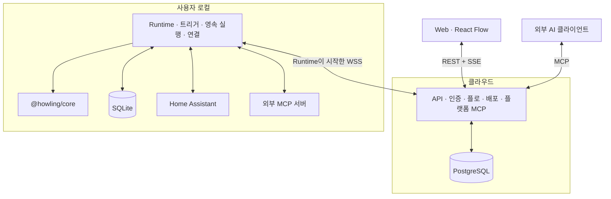
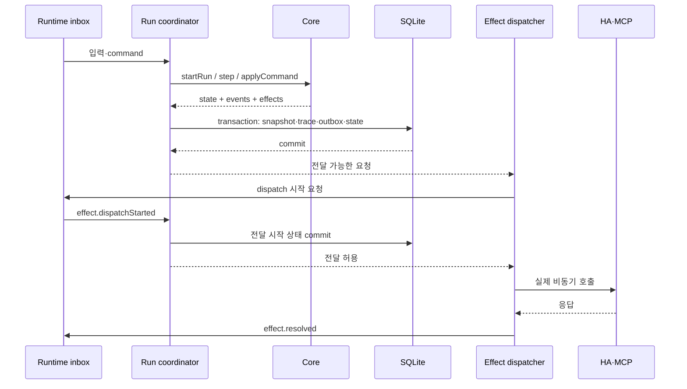

# Howling 전체 제품 상세 구현 계획

> 작성일: 2026-09-14
>
> 상태: 사용자와 논의한 전체 구조를 구현 단위·계약·검증 기준으로 상세화한 계획
>
> 목표: 웹에서 작성한 플로가 로컬 Home Assistant·MCP를 실행하고 결과가 화면으로 돌아오는 E2E 제품
>
> 선행 문서: [Core 상세 계획](./core-plan.md), [현재 패키지 지도](../docs/packages.md)

## 1. 제품 목표와 확정된 방향

Howling은 HA 고급 사용자가 노드로 자동화를 구성하고, 실제 장치를 움직이기 전에 시험하며, 실행 이유와 데이터를 확인하는 플랫폼이다. 첫 제품은 개인 소유자와 HA 공간 하나를 기준으로 완성한다. 여러 공간으로 확장할 수 있도록 데이터와 권한에는 처음부터 `siteId` 경계를 둔다.

사용자에게 제공할 한 번의 완결된 경험은 다음과 같다.

```text
로그인 → Runtime 연결 → HA 연결 확인 → 플로 작성
→ Dry run·단계 실행 → 실행 경로 확인 → 배포
→ 실제 센서 이벤트·장치 동작 → 실행 기록 확인·재생
```

### 1.1 대화에서 확정한 요구사항

| 항목 | 결정 |
| --- | --- |
| 프론트엔드 | React + React Flow |
| 첫 사용자 | Home Assistant 고급 사용자 |
| 첫 범위 | 실제 사용 가능한 E2E 제품 |
| 실행 위치 | 로컬 runtime |
| 클라우드 역할 | 편집·버전·배포·원격 관리·실행 요약 |
| MCP | 외부 서버 연결과 플랫폼 MCP 공개 모두 |
| 분석 | 관측·시각화와 판단용 노드 모두 |
| 플러그인 | 공식 구현부터 제공 |
| Dry run | 가상 입력·기록 재생. 외부 작업은 fixture로 처리 |
| 클라우드 데이터 | 요약 기본, 원본 보관은 선택 |
| Core 실행 모델 | DAG, 출력 참조, ALL·ANY, 단계·자동 실행 |
| 참고 제품 | n8n, Dify. Core 의미론은 기존 문서를 따른다 |

### 1.2 이 문서에서 정한 구현 기본값

세 개의 실행 앱 `web`, `api`, `runtime`을 같은 pnpm 모노레포에서 개발한다. API 기능은 하나의 서버 안에서 모듈로 나누고, runtime은 각 사용자 환경에 설치한다.

- Web: React·TypeScript·Vite·React Flow.
- API: Node.js·TypeScript·Fastify·PostgreSQL.
- Runtime: Node.js·TypeScript·SQLite·기존 `@howling/core`.
- 브라우저 통신: REST 명령·조회와 SSE 상태 구독.
- API와 runtime: runtime이 시작하는 인증된 WebSocket 연결.
- 개발·E2E: Docker Compose와 Playwright.
- 초기 배포: 클라우드 컨테이너 서비스와 로컬 Docker runtime. HA OS app 패키징도 같은 runtime 코드를 사용한다.

이 기본값은 구현 시작점이다. 서비스 사업자·도메인·비용·상용 운영 계정은 현재 정하지 않으며, 특정 사업자 없이 로컬 Compose에서 전체 제품을 검증할 수 있어야 한다.

### 1.3 n8n·Dify에서 참고할 제품 경험

- n8n의 실행 목록·필터·이전 실행 데이터 조회를 참고해 편집기와 실행 기록 사이의 이동을 설계한다. Howling에서는 원본이 로컬에 있으므로 조회 가능 여부와 수집 공백을 함께 표시한다. [n8n 실행 기록](https://docs.n8n.io/workflows/executions/all-executions/)
- Dify의 노드 단위 시험·중간 데이터 확인 경험을 참고해 fixture 편집, 단계 실행, 노드 입력·출력 검사를 한 화면에서 제공한다. Howling의 dry run은 장치 제어 없이 같은 core를 진행하는 별도 실행 모드로 정의한다. [Dify workflow debugging](https://dify.ai/blog/dify-1-5-0-real-time-workflow-debugging-that-actually-works)

위 항목은 참고 제품에서 가져올 설계 방향이다. 제품 runtime·저장소·물리 작업의 복구 의미론은 이 문서와 기존 core 계약으로 구현한다.

## 2. 현재 저장소와 제품 구현의 출발점

현재 저장소에는 `@howling/core`와 사용 문서·JSON 예제·테스트가 있다. 전체 구조를 검토한 시점에 core 테스트 40개와 타입 검사가 통과했다. 이 결과는 core 검증이며 실제 브라우저·HA·MCP·클라우드까지의 제품 E2E 검증은 아직 없다.

### 2.1 재사용할 계약

- `WorkflowDefinition`: 실행 그래프와 입력 바인딩.
- `compile`: 노드·연결·참조·설정 검증.
- `startRun`, `step`, `applyCommand`: 동기적인 상태 전이.
- `Transition.state/events/effects`: 한 번의 전이 결과.
- `snapshot`, `restore`: 실행 상태 직렬화·복원.
- `ExecutionEvent.runId/sequence`: 실행 기록 식별.
- `EffectRequest.id`: 외부 작업 식별.

### 2.2 운영 runtime이 추가로 맡을 부분

현재 `engine.run`과 `EngineDriver.nextCommands`는 동기 계약이다. `createLiveDriver`는 동기 외부 호출을 먼저 수행한 뒤 `effect.dispatchStarted` command를 만든다. 제품의 비동기 I/O·영속 저장 경로에는 runtime이 `step/applyCommand`를 직접 구동하는 실행 루프를 사용한다.

제품 runtime은 상태·이벤트·effect intent를 저장하고, 전달 시작을 기록한 다음 실제 호출을 해야 한다. Core의 JSON kernel과 sync API는 그대로 사용할 수 있다. 이 문서 작성 단계에서 core 코드나 테스트를 변경하지 않는다.

관련 소스:

- [현재 engine 계약](../packages/core/src/contracts/engine.ts)
- [현재 live driver](../packages/core/src/drivers/live.ts)
- [Snapshot과 Host 문서](../docs/core/10-snapshot-and-host.md)

## 3. 전체 아키텍처



### 3.1 배포 단위

| 앱 | 실행 위치 | 책임 |
| --- | --- | --- |
| `apps/web` | 브라우저, 정적 배포 | 편집·설정·시험·배포·실행 확인 |
| `apps/api` | 클라우드 컨테이너 | 사용자·공간·정의·버전·배포·runtime 연결·플랫폼 MCP |
| `apps/runtime` | 사용자 로컬 컨테이너 | HA·MCP·core 실행·로컬 원본·상태·복구 |

Web를 닫아도 실행은 계속된다. 클라우드 연결이 끊겨도 배포된 로컬 자동화는 계속된다. 원격 편집·배포·수동 실행은 API와 runtime 연결 상태에 따라 이용 가능 여부를 표시한다.

### 3.2 패키지 배치

```text
apps/
  web/
  api/
  runtime/
packages/
  core/
  contracts/
  nodes/
  connectors/
tests/
  e2e/
  fixtures/
  support/
infra/
  compose/
  home-assistant-app/
plan/
  core-plan.md
  product-plan.md
```

| 패키지 | 역할 | 의존성 경계 |
| --- | --- | --- |
| `core` | 기존 독립 실행 엔진 | UI·네트워크·저장소 독립 유지 |
| `contracts` | REST DTO, runtime protocol, 배포 artifact·요약 schema | 브라우저에서 사용할 수 있는 순수 타입·검증 |
| `nodes` | 제품 노드, 순수 구현, catalog, 편집용 설명 | Core에 의존. 실제 I/O와 secret은 없음 |
| `connectors` | HA·MCP 통신, 인증, discovery, 응답 정규화 | 서버 전용. Runtime에서 사용 |

`nodes`는 browser-safe catalog·form descriptor와 실행 구현의 export를 구분한다. `connectors`를 web dependency graph로 가져오지 않는다. Shared package는 앱의 DB repository나 HTTP route를 import하지 않는다.

## 4. 앱 내부 모듈

### 4.1 Web

| 모듈 | 책임 |
| --- | --- |
| Session·Site | 로그인·현재 공간·접근 권한 |
| Connections | runtime·HA·MCP 상태와 연결 설정 안내 |
| Flow editor | 노드·연결·입력 매핑·배치·undo/redo |
| Catalog | 노드 검색·장치·서비스·도구 선택 |
| Test session | dry run 입력·fixture·단계 제어 |
| Deployments | 버전 생성·배포·활성화 결과·rollback |
| Runs | 실행 목록·타임라인·노드 결과·재생 |
| Analytics | 공식 차트·집계·관측 설정 |

서버 데이터와 편집기 임시 상태를 분리한다. 그래프 배치 변경이 실시간 실행 상태 객체를 수정하지 않게 한다. 자동 저장 실패·충돌·연결 단절을 화면에 표시하고 편집 중인 값을 유지한다.

### 4.2 API

| 모듈 | 책임 |
| --- | --- |
| Auth·Sites | 웹 세션, 공간 소유권, token scope |
| Flows | 초안, layout, 검증, 불변 revision |
| Deployments | 원하는 revision과 activation 결과 |
| Runtime gateway | Pairing, 연결 세대, heartbeat, 요청 전달 |
| Connections·Catalog | Runtime이 보고한 metadata와 capability |
| Runs·Telemetry | Run summary, 상태 투영, 구독·상세 조회 중계 |
| Application services | 웹과 MCP가 함께 호출하는 제품 동작 |
| MCP server | Application service를 MCP tool로 공개 |

웹 route와 MCP handler에서 권한·검증·배포 로직을 각각 구현하지 않는다. 둘 다 같은 application service를 호출한다.

### 4.3 Runtime

| 모듈 | 책임 |
| --- | --- |
| Local setup | 최초 HA 연결·secret 설정·pairing 상태 |
| Connection manager | HA·MCP 연결, 자격증명, discovery |
| Trigger manager | 이벤트·시간 조건 정규화, live 입력 queue |
| Deployment manager | artifact 검증·저장·활성 포인터 전환 |
| Run coordinator | Core command·step의 직렬 처리 |
| Execution store | Snapshot·trace·effect·분석 상태 transaction |
| Effect dispatcher | 저장된 요청의 비동기 전달·응답 inbox |
| Timer manager | 실제 시간 대기와 timer 완료 command |
| Recovery manager | 재시작 후 실행·timer·outbox 복구 |
| Cloud connection | 배포 수신·요약 동기화·원격 요청 처리 |
| Observers | 공식 집계와 읽기 전용 분석 |

초기 runtime은 프로세스 하나가 SQLite writer를 소유한다. 비동기 connector callback은 DB나 core state를 직접 수정하지 않고 coordinator inbox로 결과를 전달한다.

## 5. 제품 데이터와 소유권

### 5.1 클라우드 PostgreSQL

| 모델 | 주요 내용 |
| --- | --- |
| `User`·`Session` | 로그인 주체와 웹 세션 |
| `Site`·`Membership` | 공간·소유권. v1 UI는 단일 owner |
| `RuntimeRegistration` | site 연결, runtime identity, capability, 마지막 접속 |
| `FlowDraft` | 실행 정의 초안·트리거·연결 바인딩·버전 |
| `EditorDocument` | node ID별 위치·그룹·viewport·문서 버전 |
| `FlowRevision` | 불변 실행 artifact와 fingerprint |
| `Deployment` | 원하는 revision·generation·활성화 결과 |
| `ConnectionMetadata` | 연결 이름·종류·상태·노출 기능. Secret 제외 |
| `RunSummary`·`TraceSummary` | 필터링된 실행 상태·경로·시간·오류 코드 |
| `RuntimeSyncCursor` | stream별 연속 수신 지점 |
| `ScopedToken`·`AuditEvent` | MCP/API token hash·권한·변경 이력 |
| `CapturePolicy` | 원본 전송·보관 선택과 정책 버전 |

모든 제품 데이터 접근은 `siteId`로 범위를 제한한다. Client가 보낸 site ID만 믿지 않고 인증된 사용자의 소유권을 확인한다.

### 5.2 로컬 SQLite

| 모델 | 주요 내용 |
| --- | --- |
| `RuntimeIdentity` | Pairing 결과·연결 식별 정보 |
| `ConnectionConfig` | HA·MCP 설정·암호화한 자격증명 참조 |
| `RevisionArtifact` | 받은 정확한 실행 정의·요구 버전 |
| `ActiveDeployment` | flow별 활성 generation·revision·분석 state epoch |
| `TriggerInbox` | 수락한 입력·정규화 결과·실행 예정 revision |
| `RunSnapshot` | Core snapshot·처리권·실행 상태·진행 모드·state epoch |
| `RunEvent` | 원본 실행 이벤트. `(runId, sequence)` unique |
| `RuntimeCommand` | 외부 command와 중복 처리 정보 |
| `EffectOutbox` | Effect intent·전달 상태·결과 |
| `NodeState` | Workflow·revision·state epoch·node별 live 분석 상태 |
| `ReplaySession` | Dry-run 초기 조건·fixture·명령·전달 순서 |
| `SyncJournal` | 클라우드 전송용 요약·원본 stream의 항목 |
| `ObservationSample`·`Aggregate` | 선택된 관측 데이터와 공식 집계 |

### 5.3 권위 있는 데이터

- 초안·revision·원하는 배포 상태는 API가 관리한다.
- 실제 활성 revision·실행 상태·기기 연결 상태는 runtime이 확인한다.
- 원본 trace·분석 상태는 runtime이 소유한다.
- 클라우드 summary는 runtime 기록의 투영이며 독립 실행 결과가 아니다.
- Secret은 runtime에 저장한다. Cloud workflow·trace·catalog에 포함하지 않는다.
- Web가 받은 summary로 core snapshot을 재구성하지 않는다.

## 6. Flow document와 배포 artifact

### 6.1 Core 정의를 감싸는 제품 모델

```ts
interface ProductFlowDraft {
  id: string;
  siteId: string;
  version: number;
  definition: WorkflowDefinition;
  triggers: TriggerBinding[];
  connections: ConnectionBinding[];
  executionPolicy: ExecutionPolicy;
}

interface EditorDocument {
  flowId: string;
  version: number;
  positions: Record<string, { x: number; y: number }>;
  groups: EditorGroup[];
  viewport: { x: number; y: number; zoom: number };
}

interface RevisionArtifact {
  schemaVersion: 1;
  siteId: string;
  flowId: string;
  revisionId: string;
  definition: WorkflowDefinition;
  triggers: TriggerBinding[];
  connections: ConnectionBinding[];
  requirements: RuntimeRequirements;
  executionPolicy: ExecutionPolicy;
  artifactDigest: string;
}
```

위 타입은 제품 계약의 기준이다. Core의 기존 타입을 복제해 별도로 유지하지 않고 import한다. 실제 API에서는 생성 시각·변경자·진단 등을 추가한다.

### 6.2 Version과 fingerprint

- `FlowDraft.version`은 논리 수정 충돌 방지용이다. 업데이트에 기대 버전을 보내고 충돌 시 `409`로 반환한다.
- `EditorDocument.version`은 배치 저장용이며 실행 초안 버전과 별도다.
- `revisionId`는 API가 생성한 불변 식별자다. 이를 core definition의 revision과 연결한다.
- `artifactDigest`에는 실행 정의·트리거·연결 참조·정책·요구 버전이 포함된다.
- Core의 `workflowFingerprint`는 core 정의만 검증한다. 제품 artifact 검증을 대체하지 않는다.
- 좌표·선택 상태·viewport 변경으로 실행 artifact를 새로 만들지 않는다.

### 6.3 노드 catalog

Catalog에는 type·version, 설정·입출력 schema, 제어 포트, 사용자용 이름·설명·form descriptor, 필요한 connector 종류를 포함한다.

- Browser, API, runtime은 같은 공식 node catalog 버전을 사용한다.
- API에서 저장 시 검증하고, runtime에서 실제 설치된 registry·connector capability로 다시 검증한다.
- HA 서비스·MCP 도구 discovery metadata는 catalog의 동적 선택지로 제공한다.
- MCP 도구 schema는 연결·tool identity·schema digest를 함께 저장한다.
- 외부 도구의 원본 schema는 connector에서도 검증한다. Core의 제한된 NodeSpec schema 검증만으로 외부 도구의 전체 schema를 검증했다고 판단하지 않는다.
- 외부 도구 schema가 바뀌어 호환되지 않으면 실행 전에 오류로 표시하고 사용자에게 새 schema로 검토·배포하도록 한다.
- 비밀값, 임의 실행 파일·명령 문자열을 graph의 node config로 전달하지 않는다. 로컬에 등록한 connection 참조를 사용한다.

## 7. 인증·Pairing·로컬 연결 설정

### 7.1 웹 세션

웹 로그인은 OIDC provider를 사용하고 API가 웹 세션을 관리한다. 브라우저에는 HttpOnly session cookie를 사용하며 변경 요청에는 CSRF 방어를 적용한다. 개발·E2E에는 테스트 전용 OIDC issuer를 사용해 같은 redirect·callback·session 경로를 검증한다.

첫 제품은 owner 권한으로 시작하되 API 내부 권한은 `read`, `edit`, `deploy`, `run`, `data.read`를 구분한다. 이후 collaborator 역할은 이 권한을 조합한다.

### 7.2 Runtime onboarding

1. 사용자가 로컬 runtime을 설치하고 영속 data volume을 연결한다.
2. Runtime의 로컬 setup에서 HA URL·토큰을 설정한다. HA OS app은 Supervisor API 경로를 이용한다.
3. Runtime이 API에 pairing 세션을 만들고 일회성 코드를 표시한다.
4. 로그인한 사용자가 web에서 코드를 입력해 자신의 site에 연결한다.
5. API가 runtime identity를 site에 결합하고 이후 연결용 자격증명을 발급한다.
6. Runtime이 인증된 연결을 열고 capability·HA 연결 상태·catalog를 보고한다.
7. HA 인증·초기 상태 동기화·이벤트 구독 ACK가 완료되면 연결 준비 상태가 된다.

Pairing code는 기본 10분 만료·한 번 사용이며 등록된 runtime identity에 결합한다. Pairing 완료 전에 일반 배포·실행 command를 수락하지 않는다.

아직 site에 연결되지 않은 runtime은 site 경로 밖의 `POST /api/v1/runtime-pairings`를 사용한다. 이 endpoint는 인증 전용 예외로 두고 요청 횟수를 제한한다. 응답은 `pairingId`, 사람이 입력할 code, runtime만 보관할 임시 secret을 포함한다.

Owner가 site의 `POST /runtime/pair`로 code를 승인하면 runtime은 임시 secret으로 완료 상태를 조회하고 발급된 연결 자격증명을 받는다. 조회 응답 유실에 대비해 수령 ACK 전까지 같은 자격증명을 다시 받을 수 있게 하되, 완료 ACK 또는 만료 시 임시 secret을 폐기한다. 사람이 보는 code만으로 자격증명을 가져올 수 없게 한다.

### 7.3 자격증명 경계

- HA 토큰과 MCP 자격증명은 로컬 setup으로 입력해 runtime에 보관한다.
- Runtime의 암호화 key는 DB와 구분한 로컬 파일로 관리하고 파일 접근을 제한한다.
- Credential·authorization header·OAuth code·refresh token을 application log에 남기지 않는다.
- Cloud connection 화면에는 연결 상태·이름·설정 필요 여부를 표시한다. Secret을 조회해 다시 보여주는 API는 제공하지 않는다.
- Docker setup은 localhost 또는 사용자가 보호한 로컬 경로에서 접근한다. HA OS에서는 app의 접근 경로를 이용한다.
- 로컬 setup은 초기 연결·secret 관리에 집중한다. 클라우드 편집기의 전체 복제본을 별도로 만들지 않는다.

### 7.4 단일 runtime과 교체

Site의 실행 담당 runtime은 하나다. 같은 identity의 WebSocket 재접속은 연결 generation으로 이전 연결을 대체한다. 다른 runtime을 offline 자동 승격시키지 않는다.

Runtime 교체 시 이전 로컬 runtime을 중지하거나 로컬 배포를 해제한 뒤 새 runtime을 활성화한다. Cloud credential 폐기만으로 오프라인 장치의 실행이 즉시 중단됐다고 표시하지 않는다.

## 8. REST·SSE와 Application service

### 8.1 REST의 역할

```text
/api/v1/sites/:siteId
```

아래 경로는 위 site 경로 아래에 둔다.

| Method·경로 | 기능 |
| --- | --- |
| `GET /runtime` | 연결·capability·마지막 동기화 상태 |
| `POST /runtime/pair` | Pairing code 연결 |
| `GET /connections` | HA·MCP 연결 metadata |
| `GET /catalog` | 공식 노드와 연결별 선택지 |
| `GET /flows`, `POST /flows` | 플로 목록·생성 |
| `GET /flows/:flowId` | 초안과 현재 상태 조회 |
| `PUT /flows/:flowId/draft` | 기대 버전을 포함한 논리 초안 저장 |
| `PUT /flows/:flowId/editor` | Layout 저장 |
| `POST /flows/:flowId/validate` | 검증 진단 반환 |
| `POST /flows/:flowId/revisions` | 불변 revision 생성 |
| `POST /flows/:flowId/deployments` | 지정 revision 활성화 요청 |
| `GET /deployments/:deploymentId` | 요청·검증·활성화 결과 |
| `POST /flows/:flowId/runs` | 배포된 revision의 live 수동 실행 |
| `POST /flows/:flowId/test-sessions` | 고정한 초안·revision의 dry run |
| `GET /runs`, `GET /runs/:runId` | 실행 목록·summary |
| `POST /runs/:runId/commands` | step·continue·pause·resume·cancel·fixture 입력 |
| `POST /runs/:runId/detail-requests` | 원본 상세 조회의 일회성 요청 |
| `GET /runs/:runId/events` | 권한에 맞는 summary SSE |

실행·배포 생성 요청에는 idempotency key를 사용한다. 같은 키와 같은 body는 같은 결과를 반환하고, 같은 키로 다른 요청을 보내면 거부한다.

### 8.2 Application service

웹 route와 플랫폼 MCP는 다음 기능을 공유한다.

```text
ListFlows / GetFlow / SaveDraft / ValidateFlow
CreateRevision / DeployRevision
StartLiveRun / StartDryRun / ControlRun
GetRun / GetTraceSummary / RequestRunDetails
```

권한 확인, site 검증, draft 충돌, idempotency, runtime online 확인, command 만료 처리는 이 계층에서 수행한다.

제품 제어 요청과 core command를 구분한다. `step`은 host가 `engine.step`을 한 번 호출하는 요청이고, `continue`는 host의 진행 모드를 자동으로 변경하는 요청이다. Fixture 입력은 대상 effect와 schema를 검증한 뒤 core의 `effect.resolved`로 변환한다. 제품 요청 이름을 그대로 `applyCommand`에 넘기지 않는다.

### 8.3 응답과 상태

- 동기 검증 실패는 구조화된 diagnostics로 반환한다.
- 배포·실행 요청의 HTTP `202`는 접수이며 활성화·실행 완료가 아니다.
- 응답에는 `operationId`, `runId` 또는 `deploymentId`와 조회 경로를 포함한다.
- Runtime offline이면 수동 실행·원격 제어를 즉시 실패로 반환한다. 오래된 기기 명령을 오프라인 queue에 쌓지 않는다.
- 전달 중 지연된 수동 command의 접수 만료는 기본 30초다. Runtime이 수락한 뒤의 실제 실행 시간 제한과 구분한다.

## 9. API와 Runtime 통신

### 9.1 연결

Runtime이 외부로 WSS 연결을 연다. 사용자가 집 안의 포트를 인터넷에 공개하지 않아도 API가 이 연결을 통해 요청을 보낼 수 있게 한다.

공통 envelope는 protocol version, message ID, runtime/site ID, connection generation, correlation ID, message type, payload를 갖는다. 실행 요청에는 만료 시각을 포함한다.

```ts
interface RuntimeEnvelope<T> {
  protocolVersion: 1;
  messageId: string;
  runtimeId: string;
  siteId: string;
  connectionGeneration: number;
  correlationId?: string;
  expiresAt?: string;
  type: string;
  payload: T;
}
```

### 9.2 메시지 계열

| 계열 | 대표 메시지 | 전달 정책 |
| --- | --- | --- |
| 연결 | hello·heartbeat·capabilities | 최신 상태 보고 |
| 배포 | desired deployment·activation result | generation 기반 재조정 |
| 명령 | start run·step·pause·resume·cancel | ID 중복 제거·만료 검증 |
| 목록 | connections·catalog | 버전 있는 metadata snapshot |
| 요약 | summary batch·summary ACK | 영속 journal·재전송·중복 제거 |
| 원본 | raw batch·raw ACK | 허용 정책 검증, 별도 stream |
| 상세 조회 | detail request·response | 일회성, 짧은 유효기간, 비저장 기본 |

MCP wire protocol을 이 내부 runtime protocol로 사용하지 않는다. 내부 메시지는 배포·복구·동기화 목적의 계약으로 관리한다.

### 9.3 중복·재연결

- Message ID는 전송 식별자이고 operation ID·command ID는 업무 중복 방지 식별자다.
- API가 응답을 받지 못했다고 새로운 run을 만들지 않는다. 같은 operation ID로 결과를 조회한다.
- 재접속 시 identity·protocol·capability·정책·배포 상태를 먼저 조정한다.
- 완료되지 않은 배포는 desired/active generation을 비교해 이어 처리한다.
- 만료된 수동 실행 요청을 재연결 후 자동 재생하지 않는다.
- Heartbeat는 기본 15초, 45초 동안 응답이 없으면 연결 상태를 offline으로 표시한다. 자동화 중단 여부와 별도다.

## 10. 초안·검증·배포·Rollback

### 10.1 편집과 검증

1. Web는 catalog로 노드를 구성하고 빠른 로컬 compile 진단을 표시한다.
2. API는 저장된 초안과 공식 catalog 기준으로 다시 검증한다.
3. 배포·dry run 직전 runtime이 현재 registry와 실제 connection capability로 검증한다.

브라우저의 검증 성공만으로 실제 실행 가능하다고 판단하지 않는다. 연결 오류·도구 schema 변경·노드 버전 미설치를 별도 진단으로 표시한다.

### 10.2 배포 상태

```text
requested → validating → staged → active
                         └──────→ failed
requested → superseded
```

- API는 flow별 단조 증가 deployment generation을 부여한다.
- Runtime은 artifact digest·노드 버전·connection binding을 검증하고 저장한다.
- 활성화는 SQLite transaction으로 신규 트리거가 참조할 revision 포인터를 교체하는 동작이다.
- Runtime이 commit 후 `active` 결과를 ACK해야 API와 UI도 활성화 완료로 표시한다.
- 늦게 도착한 이전 generation이 새로운 활성 상태를 덮어쓰지 않는다.
- 실패하면 이전 활성 revision을 유지한다.
- Runtime 연결이 offline인 동안 API가 받은 배포 요청은 최신 desired state로 유지할 수 있지만, UI에는 로컬 미적용 상태로 표시한다.

### 10.3 실행 중인 이전 revision

이미 수락한 입력·run은 해당 revision과 노드 버전에 고정한다. 새 활성화 이후 들어오는 입력만 새 revision을 사용한다. 대기 run과 수락된 queue가 참조하는 이전 artifact·구현 버전은 보존한다.

Live 실행 직렬화 키는 revision이 아니라 `workflowId`다. 이전 run이 끝날 때까지 새 revision의 live run도 같은 실행권을 기다린다.

분석 상태는 v1에서 `(workflowId, revisionId, stateEpoch, nodeId)`로 분리한다. `stateEpoch`는 host가 관리하는 분석 상태 세대이며 core 계약은 변경하지 않는다. 활성 배포, 수락한 입력 queue, run의 host metadata가 선택한 epoch를 저장한다.

새 revision은 빈 상태의 새 epoch로 시작한다. 과거 revision으로 rollback할 때 초기화를 선택하면 이전 상태를 덮어쓰지 않고 새 epoch를 생성한다. 이미 실행 중이거나 queue에 수락된 입력은 이전 epoch를 유지한다. 상태 유지 옵션은 같은 revision의 저장된 epoch를 명시적으로 선택하며, 다른 revision 사이의 상태 migration은 v1에서 제공하지 않는다. Rollback 기본값은 초기화다.

### 10.4 Rollback

Rollback은 이전 artifact를 대상으로 한 새로운 deployment generation이다. 과거 generation을 되살려 최신 상태를 덮어쓰는 방식으로 처리하지 않는다. 현재 진행 중인 실행은 유지하고 이후 입력부터 되돌린 revision을 사용한다.

## 11. Trigger와 실행 간 상태

### 11.1 Trigger binding

Trigger는 제품 artifact에 저장하고 runtime이 처리한다. Core에는 정규화된 입력 하나만 전달한다.

초기 trigger는 수동, HA 상태 변화·이벤트, 시간 스케줄을 지원한다. Core의 delay와 주기 trigger는 별도 기능이다.

정규화한 입력 기록에는 source, source time, received time, 원천 entity·event 정보, 정규화한 payload, 선택한 flow revision을 남긴다. API에서 들어온 수동 실행은 idempotency key로 동일 입력 중복 수락을 막는다.

### 11.2 HA 이벤트 수신

- Runtime은 하나의 HA 연결과 공유 이벤트 구독을 사용하고 활성 trigger binding으로 대상 flow를 찾는다.
- 초기 snapshot과 재연결 snapshot은 상태 동기화이며 live run을 만들지 않는다.
- 구독 준비 이전의 초기값, `unknown/unavailable`에서 복구한 첫 값은 초기 동기화로 취급한다. 초기 기본 정책에서 이 복구 자체로 기기 액션을 실행하지 않는다.
- 상태 변화 trigger는 설정한 entity와 변경 조건을 확인한다. 단순 attribute 변경을 상태값 변경과 구분한다.
- 숫자 mapping은 정상 숫자 문자열만 유한한 숫자로 변환한다. `unknown`, `unavailable`, 빈 값은 0으로 바꾸지 않는다.
- HA 재연결로 과거 이벤트가 모두 복원된다고 가정하지 않는다. 수집 공백을 기록한다.

### 11.3 Live 직렬 실행

- Flow별 live run 하나가 실행권을 가진다. Effect·timer 대기 중에도 이 실행권을 유지한다.
- 같은 flow의 중첩 입력은 로컬의 제한된 FIFO queue에 저장한다.
- 초기 queue 상한은 flow당 100개다. 초과 시 새 입력을 거부하고 `trigger.dropped` 운영 요약을 남긴다.
- 자동 trigger 입력의 시작 유효기간은 기본 5분이다. 아직 시작하지 못한 오래된 입력은 만료시키고 기록한다. 설정으로 조정할 수 있다.
- 이 유효기간은 이미 실행 중인 run의 delay·외부 작업을 취소하지 않는다.
- 수락한 queue 항목의 revision은 변경하지 않는다.
- 서로 다른 flow는 독립적으로 진행한다. 하나의 flow의 결과 불명 상태가 다른 flow를 막지 않는다.

### 11.4 분석 상태 commit

성공한 분석 노드의 `node.stateUpdated`를 해당 core 전이와 같은 SQLite transaction에서 `NodeState`에 반영한다. `(runId, eventSequence)` 기준으로 한 번만 적용한다.

다음 live run을 시작할 때 입력이 고정한 revision·state epoch의 `NodeState`를 `initialState`로 전달한다. 뒤의 액션 노드가 실패하거나 run이 취소되어도 이미 성공한 분석 상태를 되돌리지 않는다.

Dry-run의 `proposedState`는 live `NodeState`에 쓰지 않는다. Replay session의 별도 상태로만 저장한다.

## 12. Runtime 영속 실행 루프

### 12.1 단일 writer

Coordinator의 단일 writer만 core command를 반영하고 SQLite 상태를 변경한다. 외부 worker의 callback, 브라우저 제어, cloud command, timer도 모두 같은 inbox로 들어온다.

Host는 run마다 `progressionMode: manual | auto`를 영속화한다. 이 값은 core의 pause 상태와 별개다. 단계 실행 세션은 `manual`로 시작하고 Step 요청마다 한 단계 진행한다. Continue는 `auto`를 저장한 뒤 진행한다. 재시작 후 ready node가 있어도 manual run은 사용자 입력을 기다린다.



### 12.2 전이 transaction

다음 데이터를 한 transaction에서 저장한다.

1. 새로운 run snapshot과 run 상태.
2. 이번 전이의 원본 execution events.
3. 새로운 effect outbox 항목 또는 기존 effect 상태.
4. Command 중복 처리 정보.
5. 성공한 노드의 live 분석 상태 변경.
6. 해당 전이에서 생성한 cloud summary journal 항목.

Commit 이후에만 UI 구독·observer·외부 worker에 새 결과를 알린다. Network 호출을 DB transaction 안에서 기다리지 않는다.

Timer 완료를 반영하기 전에 같은 inbox에서 `clock.advanced`를 먼저 반영·저장한다. Live는 기존 logical time과 현재 시각 중 큰 값을, dry run은 재생 schedule의 가상 시각을 사용한다. 그 뒤 timer 완료 응답을 반영한다. 이 순서를 보장해야 다음 delay가 이전 logical time으로 예약되지 않는다.

### 12.3 Effect 전달

- Outbox는 `effectId`로 중복을 제거한다.
- Coordinator가 현재 pause·cancel·revision·권한 상태를 확인한 후 전달 시작을 기록한다.
- `dispatchStarted` 기록과 outbox 상태가 commit된 뒤 실제 호출한다.
- 응답은 새 command로 inbox에 전달한다. Worker가 snapshot을 직접 덮어쓰지 않는다.
- Adapter timeout은 호출 전 확정 실패인지, 이미 수행됐을 수 있는 결과 불명인지 구분한다.
- 결과 불명은 확인 전까지 자동 재시도하지 않는다.
- Pause 중 새 요청은 저장만 하고 전달하지 않는다. Resume 시 미전달이 확인된 requested 항목의 최초 전달을 이어간다.
- Cancel 뒤 늦은 응답은 진단으로 보존하며 후속 노드를 시작하지 않는다.

### 12.4 재시작 복구

| 저장된 상태 | 복구 동작 |
| --- | --- |
| Ready node가 있는 run | 정확한 artifact로 복원. auto이며 pause·cancel 상태가 아닐 때만 자동 진행; manual은 Step 대기 |
| 전달 시작 전 requested effect | 미전달이 journal로 확정되면 최초 전달 |
| dispatchStarted, 최종 응답 없음 | 결과 불명으로 유지·표시. 자동 재전송 금지 |
| 응답 inbox에 저장, 아직 미반영 | 같은 command ID로 반영 |
| 이미 resolved인 effect | 재호출하지 않음 |
| Live timer 대기 | 현재 시각과 dueAt 확인. clock 전이를 저장한 뒤 완료 command 반영 |
| Dry-run timer 대기 | 저장된 가상 시간·schedule·진행 모드에 따라 clock 전이 후 완료 반영 |
| Pause·cancel 상태 | 상태를 유지하고 새로운 외부 작업을 시작하지 않음 |

Snapshot restore는 pending effect를 새로 발행하지 않는다. Runtime은 core snapshot과 outbox·응답 inbox를 함께 사용한다. 외부 시스템까지의 exactly-once를 보장한다고 표시하지 않는다.

## 13. Home Assistant connector

### 13.1 초기 기능

- WebSocket 인증·재연결.
- 상태·entity 목록과 서비스 metadata 조회.
- `state_changed`·선택한 이벤트 구독.
- 서비스 호출과 응답 정규화.
- 연결 상태·마지막 동기화·수집 공백 보고.

HA의 `/api/websocket`은 상태 스트리밍·서비스 호출을 지원한다. 이 API를 실제 장치 연결 계층으로 사용한다. [HA WebSocket API](https://developers.home-assistant.io/docs/api/websocket/)

### 13.2 연결 준비 상태

```text
configured → connecting → authenticating → synchronizing → ready
                                     └──────────────────→ error
ready → disconnected → reconnecting
```

Ready는 TCP 연결만 성립한 상태가 아니다. 인증, 초기 상태 동기화, 이벤트 구독 ACK를 확인한 뒤 ready로 표시한다.

### 13.3 실제 동작의 표현

- 서비스 응답 성공은 요청 처리 결과로 기록한다.
- 실제 entity의 `state_changed` 또는 상태 조회 결과는 별도 관측 기록이다.
- 모든 서비스가 특정 상태 변화로 이어진다고 가정하지 않는다.
- 연결이 끊겨 응답을 잃으면 성공·실패를 임의 판정하지 않는다.
- 제품 노드는 사용자에게 entity·서비스·필드를 선택하게 하고, 연결 식별자와 정규화한 요청을 effect로 만든다.

### 13.4 설치 형태

Docker에서는 HA URL과 사용자 토큰을 로컬 setup으로 받는다. HA OS app에서는 Supervisor proxy와 app 권한을 사용한다. 두 경우 같은 connector 계약을 사용한다. [HA app 통신](https://developers.home-assistant.io/docs/apps/communication/)

## 14. MCP 연결과 플랫폼 공개

### 14.1 외부 MCP client

Runtime의 MCP connection manager가 다음을 담당한다.

- 로컬 stdio와 원격 Streamable HTTP 연결.
- 서버 기능·tools·입출력 schema discovery.
- 도구 호출과 성공·오류·결과 불명 정규화.
- 서버별 credential, OAuth 흐름, 재연결·tool schema 갱신.
- 도구 identity·schema digest와 node binding의 호환 확인.

MCP protocol 세부 차이는 공식 SDK를 사용하는 connector 안에 둔다. Core definition에 session·transport wire shape를 노출하지 않는다. Resources 조회 노드는 다음 확장으로 열어두되 첫 E2E의 필수 항목은 tools 호출이다.

StdIO 서버의 실행 파일·인자는 runtime 소유자가 로컬에 등록한 connection 설정에서 관리한다. Cloud가 임의 shell command를 전송하는 인터페이스를 만들지 않는다.

### 14.2 외부 MCP 인증

- Bearer·API key 등 정적 credential은 로컬 secret store에 저장한다.
- OAuth가 필요한 원격 연결에서는 runtime이 state·PKCE verifier와 연결 세션을 생성한다.
- Web는 runtime이 제공한 authorization URL을 열고, API callback은 code를 해당 runtime 세션에 일회성으로 중계한다.
- Token 교환과 refresh는 runtime이 수행한다. API callback은 code·token을 영속 저장하거나 로그에 남기지 않는다.
- Callback까지 runtime이 offline이면 연결을 성공으로 표시하지 않는다. 만료한 세션은 다시 시작한다.

### 14.3 플랫폼 MCP server

API 앱의 `/mcp`에서 다음 기능을 공개한다.

| Tool 역할 | 호출할 서비스 |
| --- | --- |
| 플로 목록·조회 | ListFlows·GetFlow |
| 초안 작성·변경 | SaveDraft |
| 검증 | ValidateFlow |
| Dry run | StartDryRun |
| Revision·배포 | CreateRevision·DeployRevision |
| 실제 실행 | StartLiveRun |
| 실행 상태·기록 | GetRun·GetTraceSummary |

첫 플랫폼 MCP 인증은 owner가 발급한 site·flow·scope 제한 bearer token으로 제공한다. API는 token 원문 대신 hash를 저장한다. Token을 만들 때 읽기·편집·배포·실행·원본 조회 범위를 구분한다. 대화형 OAuth 등록 UX는 후속 기능으로 둔다.

실제 실행은 허용된 배포 플로에만 가능하다. 초안 작성은 자동 배포로 이어지지 않는다. 원본 조회는 별도 `data.read`와 상세 조회 요청을 요구한다.

MCP로 시작한 run도 웹 실행과 같은 revision·권한·idempotency·trace 경로를 사용한다. MCP 전용 실행 엔진을 추가하지 않는다.

## 15. Dry run·단계 실행·재생

### 15.1 위치와 저장

공식 dry-run 세션은 runtime에 생성한다. Browser는 빠른 compile과 fixture 편집을 담당하고 실제 시험 결과는 runtime의 동일 node registry에서 만든다.

Dry-run 시작 시 초안이나 지정 revision을 고정한 test artifact를 만든다. 이후 편집한 draft는 이미 시작한 test session을 바꾸지 않는다.

저장할 내용:

- 정확한 test artifact·core fingerprint·노드 버전.
- 초기 input·분석 상태·논리 시간.
- Fixture bundle version과 기대 요청.
- 응답 전달 기록·순서·가상 시간 command.
- Core snapshot과 원본 test trace.

### 15.2 Step UI

1. 입력 fixture와 시작 상태를 선택한다.
2. 다음 준비 노드와 입력 preview를 표시한다.
3. Step을 누르면 노드 하나를 진행한다.
4. 노드 입출력·선택 포트·대기 effect를 표시한다.
5. Fixture가 없으면 요청 내용을 보여주고 응답 입력을 기다린다.
6. Continue는 같은 coordinator가 자동으로 진행하도록 전환한다.

Pause·resume·cancel은 runtime command로 처리한다. 브라우저 재접속 시 test snapshot과 cursor로 같은 세션을 연다.

### 15.3 외부 작업과 데이터

- Dry-run에 실제 external adapter를 연결하지 않는다.
- 요청 일치 검증을 통과한 fixture·기록 응답만 사용한다.
- 가상 timer는 가상 시간으로만 해소한다.
- Live run 기록에서 replay를 시작하면 새로운 dry-run을 만든다. 기존 live run의 mode를 변경하지 않는다.
- 누락 원본·수집 공백·fixture 불일치를 검증 불가로 표시한다.
- Dry-run 재시작 복원은 snapshot뿐 아니라 fixture·schedule도 함께 복원한다.
- Test 결과 상태는 live 분석 상태에 쓰지 않는다.

## 16. Trace·동기화·데이터 보관

### 16.1 원본과 요약

| 데이터 | 로컬 | 클라우드 기본 |
| --- | --- | --- |
| Run ID·revision·mode·상태 | 저장 | 저장 |
| 노드·edge 상태와 경로 | 저장 | 저장 |
| 실행 시각·소요시간·오류 코드 | 저장 | 저장 |
| 센서 input·node output | 저장 정책 적용 | 저장하지 않음 |
| Effect payload·원문 오류 메시지 | 비밀값 제거 후 로컬 | 저장하지 않음 |
| 승인된 공식 집계 | 저장 | 선택한 집계만 저장 |
| Secret·authorization header | Trace에 기록하지 않음 | 저장하지 않음 |

요약에 raw payload를 포함한 오류 메시지나 임의 metadata가 섞이지 않도록 allowlist 기반 projection을 사용한다. Core event 전체를 그대로 cloud에 전송하지 않는다.

### 16.2 동기화 cursor

원본 `(runId, sequence)`와 동기화 cursor를 분리한다. 요약에서 제외한 원본 이벤트 때문에 sequence가 비연속일 수 있다.

- 필터링한 뒤 `SyncJournal`의 stream별 `syncSeq`를 부여한다.
- Cloud는 `(runtimeId, stream, syncSeq)`로 중복을 제거한다.
- ACK는 해당 stream에서 연속 저장한 syncSeq 기준이다.
- 원본 run ID와 sequence는 추적용으로 유지한다. 요약에서 원본 sequence가 비었다고 유실로 판단하지 않는다.
- Summary stream과 raw stream의 cursor를 분리한다. 원본 전송 실패가 요약 동기화를 막지 않는다.
- 원본 전송 취소와 보관 기간이 지난 미전송 summary는 원래 `syncSeq`를 유지한 payload 없는 tombstone으로 바꾼다. 두 stream 모두 tombstone을 전송·ACK해 연속 cursor를 해소한다.
- 미전송 journal 항목을 단순 삭제하거나 뒤쪽 sequence에 gap 이벤트만 추가하지 않는다. 오래된 payload를 정리하더라도 해당 sequence의 ACK 또는 명시적 재동기화가 끝날 때까지 cursor 해소 정보를 보존한다.

### 16.3 SSE와 재접속

브라우저 SSE에는 API가 저장한 summary projection의 cursor를 사용한다. `Last-Event-ID` 또는 명시적 after cursor로 이어받는다. 현재 run snapshot 요약과 이후 이벤트를 연결해 표시한다.

Cursor가 보관 범위 밖이면 조용히 일부만 보여주지 않고 재동기화 필요 응답을 반환한다. Web는 최신 summary를 다시 조회하고 수집 가능한 구간을 표시한다.

### 16.4 일회성 상세 조회

사용자가 상세 입력·출력을 요청하면 API가 권한을 검사하고 runtime에 특정 run·node·필드 조회를 요청한다. 원본을 cloud DB에 저장하지 않고 응답을 중계한다.

이 전송은 raw 백그라운드 동기화와 구분한다. 사용자의 요청 범위·시각을 audit에 남기되 응답 payload를 로그에 남기지 않는다. Runtime offline이나 원본 삭제 시 명확한 unavailable 상태를 반환한다.

### 16.5 원본 전송 선택

- 기본값은 OFF다.
- ON 이후 생성되는 선택한 필드의 데이터부터 적용한다. 과거 원본을 자동 소급 업로드하지 않는다.
- 재연결 시 최신 정책을 먼저 반영한다. OFF이면 아직 전송하지 않은 raw payload를 폐기하고 cursor를 해소한다.
- 이미 저장한 원본의 즉시 삭제는 별도 삭제 작업으로 제공한다. OFF가 과거 데이터 삭제까지 완료했다고 표시하지 않는다.

### 16.6 보관 기본값

- 로컬 원본 trace: 7일.
- 클라우드 summary: 30일.
- 선택한 클라우드 원본: 7일.
- 로컬 원본·관측 데이터의 기본 용량 상한: 합계 1 GiB. 기간·용량 중 먼저 도달한 기준으로 오래된 완료 run payload를 정리한다.
- 진행 중 run snapshot, 미해소 effect journal, 참조 중 artifact, live 분석 상태는 원본 trace 정리 대상에서 제외한다.
- 요약 journal은 ACK 후 정리한다. 미전송 요약이 장기간 쌓이면 별도 운영 저장량 경고를 내고, payload 보관 기한이 지나면 16.2의 같은 sequence tombstone으로 교체해 수집 공백을 표시한다.
- DB 저장 실패 시 새 물리 작업을 수행하지 않는다. 저장을 확인할 수 없는 상태로 실행을 계속하지 않는다.

## 17. Web 화면과 사용자 흐름

### 17.1 공간·연결 화면

- Runtime pairing·연결 상태·마지막 동기화 시각.
- HA 인증·상태 동기화·구독 상태.
- MCP 연결·도구 목록·schema 변경 알림.
- 데이터 전송·보관 설정.

### 17.2 플로 목록

- 초안 존재·활성 revision·배포 대기·최근 실행 상태.
- 실행 on/off, 복제, export/import, 기록 이동.
- Runtime offline일 때 최근 확인한 활성 상태와 시각을 함께 표시.

### 17.3 편집기

| 영역 | 기능 |
| --- | --- |
| 왼쪽 | 노드·장치·서비스·도구 검색 |
| 중앙 | React Flow 캔버스, 연결·그룹·노드 상태 |
| 오른쪽 | 노드 설정·필드 mapping·schema·값 preview |
| 하단 | 실행 타임라인·진단·effect·fixture·step |
| 상단 | 저장 상태·검증·dry run·revision·배포 |

입력 mapping은 source node·output·JSON Pointer를 고르는 방식으로 core binding을 만든다. 필수 참조가 가용하지 않으면 연결·설정에서 진단을 표시한다.

### 17.4 실행 상세

- 어떤 revision과 trigger로 시작했는지 표시한다.
- 전체 경로·노드 결과·건너뛴 이유·대기·오류·결과 불명을 구분한다.
- HA 서비스 응답과 장치 상태 관측을 별도 항목으로 표시한다.
- ANY 승자와 남은 실행 경로를 함께 표시한다.
- 원본 상세 요청, 같은 입력 재생, fixture 보완을 제공한다.

### 17.5 UI 상태 원칙

- 초안 저장, 검증 성공, 배포 접수, 로컬 활성화, 실행 성공은 서로 다른 상태다.
- 화면을 닫아도 live·dry-run 세션은 runtime 정책에 따라 유지한다.
- Web 연결이 끊겼다는 이유로 실행을 취소하지 않는다.
- 실제 adapter가 없는 화면 시제품을 live 동작 완료로 표시하지 않는다.

## 18. 공식 분석과 확장 경계

### 18.1 판단용 노드

첫 E2E는 기존 `analysis.rolling-mean`을 사용한다. 이후 공식 집계·임계값·지속시간 노드는 같은 NodeSpec·상태 계약으로 추가한다.

판단 결과는 명시적인 노드 출력으로 후속 조건·액션에 연결한다. 관측 플러그인이 장치를 직접 제어하지 않는다.

### 18.2 관측과 차트

- 사용자가 관측할 node·field를 선택한다.
- Commit된 이벤트를 observer가 읽어 숫자 sample·집계·차트용 결과를 만든다.
- Observer는 자체 cursor를 사용하고 재시작 후 중복 없이 이어 처리한다.
- Observer 실패·지연은 automation coordinator를 중단시키지 않는다.
- 고빈도 입력은 관측 필드·보관 기간·집계 수준을 제한할 수 있게 한다.
- 첫 화면은 시계열 값, 실행 횟수·성공률, 노드별 소요시간과 최근 오류를 제공한다.

### 18.3 플러그인 버전

공식 플러그인은 type·version·입출력·상태 schema와 관측 기능을 가진 manifest로 관리한다. 실행은 정확한 버전으로 고정한다. 외부 코드 설치·sandbox·마켓플레이스는 후속 범위다.

## 19. 개발 환경·배포·운영

### 19.1 개발 환경

Compose 개발 profile은 web, API, PostgreSQL, runtime, 테스트 HA, 테스트 MCP, 테스트 OIDC issuer, 테스트 TLS gateway를 제공한다. Runtime data와 PostgreSQL data는 별도 volume을 사용한다.

E2E의 제품 origin은 `https://howling.test`, OIDC issuer는 `https://auth.howling.test`처럼 고정한다. 브라우저·API·runtime이 같은 이름으로 접근하도록 테스트 network의 DNS alias를 구성하고 OIDC redirect URI도 제품 origin에 맞춘다. Playwright도 이 network 안에서 실행한다. 테스트 CA는 해당 컨테이너와 브라우저 profile에만 신뢰시키며 TLS 검증을 끄거나 사용자 시스템의 인증서 설정을 바꾸지 않는다. WSS 재접속과 웹 인증을 이 경로에서 함께 검증한다.

Workspace에 `apps/*`를 추가하고 루트 명령을 다음 용도로 구성한다.

| 명령 목적 | 동작 |
| --- | --- |
| `pnpm dev` | 앱 개발 서버와 필요한 서비스 안내·기동 |
| `pnpm build` | Shared packages와 세 앱 build |
| `pnpm typecheck` | 전체 타입 검사 |
| `pnpm test` | 단위·계약·integration 테스트 |
| `pnpm test:e2e` | 격리 Compose 환경과 Playwright 검증 |

실제 사용자의 HA·MCP endpoint를 테스트 기본값으로 사용하지 않는다. 테스트용 인증정보는 매 실행 생성하고 영속 사용자 설정과 분리한다.

### 19.2 배포

- Web는 정적 자산으로 배포한다. 외부에는 동일 제품 origin 아래 web·API·MCP 경로를 제공한다.
- API는 장기 WebSocket 연결을 유지할 수 있는 컨테이너에서 실행한다.
- Runtime은 `/data` 영속 volume을 사용하는 Docker 이미지로 배포한다.
- HA OS app은 동일 runtime build를 감싸며 Supervisor 설정·권한·로컬 setup 경로를 제공한다.
- API·runtime protocol, artifact schema, node catalog version을 release manifest에 기록한다.
- 실행 중 run에 필요한 이전 node implementation을 제거하는 업데이트는 해당 run을 종료·복구할 수 있는 경로를 먼저 확보한다.

### 19.3 Migration과 운영 관측

- Cloud DB와 runtime DB migration은 각 앱이 명시적 schema version으로 관리한다.
- Runtime DB migration 전에 일관된 로컬 backup을 만들고, 실패하면 외부 작업을 시작하지 않는다.
- Health와 readiness를 구분한다. HA unavailable은 API 전체 프로세스가 죽었다는 의미가 아니다.
- 관측 항목은 runtime online, HA 구독 상태, queue 깊이·만료, 미확정 effect, sync backlog, 저장 용량, 배포 실패다.
- Application log는 payload allowlist를 적용한다. Trace 원본이 일반 서버 로그로 중복 유출되지 않게 한다.

## 20. 실제 E2E 환경과 테스트 부트스트랩

### 20.1 검증할 경로

```text
Playwright 브라우저
→ Web에서 작성·저장·배포
→ 실제 API와 PostgreSQL
→ 실제 WSS 연결
→ Runtime과 SQLite
→ 실제 HA WebSocket·서비스
→ 실제 HA helper 상태 변경
→ Runtime trace·summary 동기화
→ 브라우저 실행 상세
```

이 테스트는 HA API까지의 통합을 증명한다. 물리 센서·무선망·실제 가전 동작은 별도 설치 환경에서 확인한다.

### 20.2 테스트용 Home Assistant

HA Container 이미지는 CI에서 특정 버전으로 고정하고 매 테스트 환경마다 새 config volume을 사용한다.

```yaml
default_config:

input_number:
  test_power:
    name: Test Power
    initial: 0
    min: 0
    max: 5000
    step: 1

input_boolean:
  test_alert:
    name: Test Alert
    initial: false
```

Test bootstrap은 `/api/onboarding`이 준비될 때까지 기다린 뒤 HA onboarding 경로로 테스트 owner를 만들고 authorization code를 `/auth/token`에서 교환한다. 이후 인증된 WebSocket의 `auth/long_lived_access_token`으로 테스트 전용 토큰을 생성해 runtime secret 파일로 전달한다. 인증된 상태 조회로 두 helper가 존재하고 값이 각각 `0`, `off`인지 검증한 뒤 runtime 연결을 시작한다.

Onboarding API 사용은 고정한 HA 이미지에 맞춘 테스트 지원 코드로 관리한다. `.storage`를 직접 조작하거나 인증을 해제해 통과시키지 않는다. 토큰 원문은 테스트 출력·스크린샷·artifact에 남기지 않는다.

참고: [HA 인증 API](https://developers.home-assistant.io/docs/auth_api/), [HA onboarding 구현](https://github.com/home-assistant/core/blob/dev/homeassistant/components/onboarding/views.py), [input_number 설정](https://www.home-assistant.io/integrations/input_number/).

### 20.3 테스트용 MCP와 OIDC

- MCP 테스트 서버는 실제 MCP transport와 SDK를 사용한다.
- 고정 응답, 요청 echo, 지연, 명시적 오류, 응답 유실을 제공한다.
- Server의 도구 호출 횟수와 요청 ID를 별도로 기록한다.
- 플랫폼 MCP는 reference client가 실제 `/mcp`에 연결해 권한 있는 token으로 호출한다.
- OIDC issuer는 테스트 전용 계정·signing key를 제공하되 API의 일반 login callback·cookie 경로를 사용한다.
- 테스트 전용 서비스·인증 기능은 production profile에 포함하지 않는다.

### 20.4 전력 평균 시나리오

브라우저에서 다음 플로를 만든다.

```text
HA test_power 변경
→ { power: 숫자 } 입력
→ 최근 5개 이동 평균
→ mean > 1000
→ input_boolean.test_alert 켜기
```

초기 조건:

- 분석 상태는 빈 배열.
- test_alert는 OFF.
- 초기 HA snapshot은 샘플에 포함하지 않음.
- Runtime ready·구독 ACK·배포 active ACK를 확인한 뒤 입력 시작.

`input_number.set_value`를 이용해 아래 값을 넣는다. 각 값마다 run 종료와 상태 commit을 기다린다.

| 입력 순서 | 값 | 평균 | 조건 | HA action |
| --- | --- | --- | --- | --- |
| 1 | 800 | 800 | false | 0회 |
| 2 | 900 | 850 | false | 0회 |
| 3 | 1100 | 933.333… | false | 0회 |
| 4 | 1200 | 1000 | false | 0회 |
| 5 | 1400 | 1080 | true | 1회 |

다섯 번째 run의 revision, effect ID, 실제 outgoing HA 서비스 요청, HA 상태 변경, 브라우저 trace를 연결해 검사한다.

장치가 ON이라는 사실만으로 요청이 한 번이었다고 판단하지 않는다. 테스트 전송 계층에서 outgoing 서비스 호출 횟수도 측정한다.

## 21. 제품 검증 목록

### 21.1 편집·배포

- 로그인·pairing·HA ready가 UI까지 이어진다.
- 그래프·binding·layout 저장 후 재열기에 보존된다.
- 잘못된 연결·참조는 진단과 함께 배포가 거부된다.
- Layout 변경이 실행 fingerprint를 바꾸지 않는다.
- Draft 충돌은 덮어쓰지 않고 명시적으로 표시된다.
- Active ACK 전에는 배포 완료로 표시하지 않는다.
- 이전 generation의 늦은 응답이 최신 배포를 덮어쓰지 않는다.
- Rollback 후 신규 입력만 되돌린 revision으로 실행된다.
- 상태 초기화 rollback 뒤에도 이미 수락한 queue는 이전 epoch를 사용하고 신규 입력은 새 epoch를 사용한다.

### 21.2 실제 실행·상태

- 다섯 센서 입력이 다섯 run으로 처리되고 평균 1080에서 실제 helper가 바뀐다.
- 정상 서비스 응답과 실제 state 변화가 각각 기록된다.
- Flow별 직렬화로 분석 상태 갱신이 충돌하지 않는다.
- Queue 초과·입력 만료가 조용히 사라지지 않고 기록된다.
- 다른 flow의 대기·실패가 전체 runtime을 정지시키지 않는다.

### 21.3 Dry run

- 같은 초기 조건에서 같은 분기·예정 action을 얻는다.
- 실제 HA·MCP external 호출이 0회다.
- Live 분석 상태와 HA helper 상태가 변하지 않는다.
- Fixture 누락은 `needs-input`이며 응답 입력 후 이어 진행된다.
- Step과 auto의 결과가 일치한다.
- Runtime 재시작 후 가상 시간·fixture 순서가 유지된다.
- Manual 세션 재시작 후 ready node가 자동 실행되지 않으며 Continue 이후에만 자동 진행한다.
- 연속 delay의 두 번째 dueAt은 첫 timer 완료 시 반영한 logical time을 기준으로 계산된다.

### 21.4 장애·복구

- Snapshot·intent 저장 직후 종료해도 미전달 요청의 최초 실행이 가능하다.
- 외부 전달 후 응답 저장 전 종료하면 복원 후 자동 재전송하지 않고 결과 불명으로 표시한다.
- 저장된 응답 command의 중복 반영이 상태·trace·분석을 중복 갱신하지 않는다.
- Pause 중 새 요청이 전달되지 않고 resume 후 미전달 요청이 진행된다.
- Cancel 뒤 늦은 응답이 run을 부활시키지 않는다.
- Cloud 연결을 끊은 상태에서 다섯 번째 입력을 넣어도 로컬 장치가 켜진다.
- 재연결 후 summary를 빠짐·중복 없이 보충한다.
- HA 단절 후 snapshot 동기화가 새 자동화 trigger로 잘못 실행되지 않는다.

### 21.5 MCP·권한

- 외부 MCP tool discovery·호출·오류·schema 변경이 동작한다.
- 플랫폼 MCP로 만든 초안이 같은 검증 규칙을 통과한다.
- 웹과 MCP에서 같은 revision을 실행하면 같은 runtime 기록 체계를 사용한다.
- 읽기 token으로 배포·live 실행·원본 조회가 거부된다.
- 다른 site의 connection·flow·run·trace를 조회하거나 조작할 수 없다.
- Runtime offline·command 만료가 MCP에서도 동일하게 표현된다.

### 21.6 데이터 정책

- 기본 cloud DB·SSE·로그에 센서 원본 값·effect payload·원문 오류 메시지가 없다.
- Summary에 제외된 원본 sequence가 있어도 sync ACK가 진행된다.
- 원본 ON 이후 데이터만 선택적으로 보관된다.
- Offline 동안 OFF로 바꾼 뒤 재접속하면 대기 raw payload가 업로드되지 않는다.
- 원본 실패가 summary stream을 막지 않는다.
- 미전송 payload 만료·전송 취소 후에도 원래 sequence의 tombstone이 ACK되어 두 stream의 cursor가 계속 진행한다.
- 상세 조회는 권한을 확인하고 cloud 원본 보관을 자동 활성화하지 않는다.
- 보관 정리가 진행 중 snapshot·미확정 outbox를 삭제하지 않는다.

## 22. 구현 순서와 단계별 완료 조건

### 단계 0 — 앱 골격과 계약

Apps workspace, 공통 contracts, API·runtime·web 실행, Compose, DB migration과 테스트 issuer를 구성한다. 최소 화면에서 API·runtime 상태를 확인한다.

완료: 한 개발 환경에서 세 앱이 연결되고 build·typecheck·health 검증이 통과한다.

### 단계 1 — 영속 runtime

Run coordinator, SQLite store, effect outbox, timer, recovery를 구현한다. 가짜 외부 adapter를 사용하되 저장 순서와 crash recovery를 먼저 검증한다.

완료: Core transition이 DB에 저장되고 재시작 후 중복 외부 작업 없이 이어진다.

### 단계 2 — HA와 최소 제품 경로

Local setup·pairing·HA connector, flow draft·revision·deployment, 최소 React Flow 편집기·실행 상세를 함께 구현한다.

완료: 브라우저에서 만든 평균 플로가 실제 HA helper를 바꾸고 동일 run이 화면에 나타난다. 서버에 미리 하드코딩한 플로만 실행되는 상태로 완료 처리하지 않는다.

### 단계 3 — Dry run과 운영 복구

Fixture 편집·step·continue, replay session, summary SSE·cursor, cloud offline·runtime restart·deployment rollback을 완성한다.

완료: 실제 호출 없는 시험과 기록 재생이 가능하며 단절·재접속·불명 결과를 확인할 수 있다.

### 단계 4 — 양방향 MCP

외부 MCP 연결·인증·tool catalog·effect와 플랫폼 `/mcp` tool·scoped token을 구현한다.

완료: 실제 MCP transport로 양방향 요청이 흐르고 웹과 동일한 권한·revision·trace를 사용한다.

### 단계 5 — 분석·패키징·제품 마무리

공식 관측 차트·집계, 원본 선택 정책·보관, HA OS app 패키징, 온보딩 안내·오류 상태를 완성한다.

완료: 새 사용자 환경에서 설치→연결→작성→시험→배포→관측을 문서와 제품 화면으로 수행할 수 있다.

## 23. 최종 산출물과 완료 판정

최종 산출물:

- 세 실행 앱과 browser-safe shared package.
- Cloud·runtime DB migration과 연결·배포·실행 protocol.
- HA·MCP connector와 공식 제품 노드 catalog.
- 편집·dry run·배포·실행 상세·연결·분석 화면.
- Docker runtime, HA OS app 패키징, Compose 개발·E2E 환경.
- 실제 브라우저·HA·MCP를 통과하는 자동 테스트와 설치·운영 문서.

제품 완료는 페이지가 렌더링되거나 core 테스트가 통과한 것만으로 판정하지 않는다. 다음 세 조건을 모두 충족해야 한다.

1. 사용자가 브라우저에서 작성한 정의가 배포되어 실제 HA API를 통해 장치 상태를 바꾼다.
2. 같은 제품에서 dry run·단계 실행·재생과 실행 원인 추적을 할 수 있다.
3. 연결 단절·재시작·중복 메시지·원본 전송 정책을 포함한 운영 경계가 E2E로 검증된다.

후속 범위는 다중 고객 운영·실시간 공동 편집·외부 플러그인 유통·범용 반복/subflow·실시간 shadow·자동 상태 마이그레이션·과금이다. 현재 제품의 완료 조건을 이 기능들의 선행 구현에 의존시키지 않는다.

## 24. 참고 문서

- [Howling core 계획](./core-plan.md)
- [Howling 현재 패키지 지도](../docs/packages.md)
- [Howling snapshot·host 경계](../docs/core/10-snapshot-and-host.md)
- [Howling 실행 계약](../packages/core/src/contracts/engine.ts)
- [Howling event 계약](../packages/core/src/contracts/event.ts)
- [Home Assistant WebSocket API](https://developers.home-assistant.io/docs/api/websocket/)
- [Home Assistant app 통신](https://developers.home-assistant.io/docs/apps/communication/)
- [Home Assistant 인증 API](https://developers.home-assistant.io/docs/auth_api/)
- [MCP 아키텍처](https://modelcontextprotocol.io/docs/2026-07-28/learn/architecture)
- [MCP 인증](https://modelcontextprotocol.io/specification/2026-07-28/basic/authorization)

외부 protocol·SDK·HA 이미지 버전은 구현 시작 시 호환되는 버전으로 고정하고 lockfile·release manifest·E2E 이미지 설정에 기록한다. 이 문서는 전체 제품을 만들기 위한 기준이며 구현 완료 보고서가 아니다.
